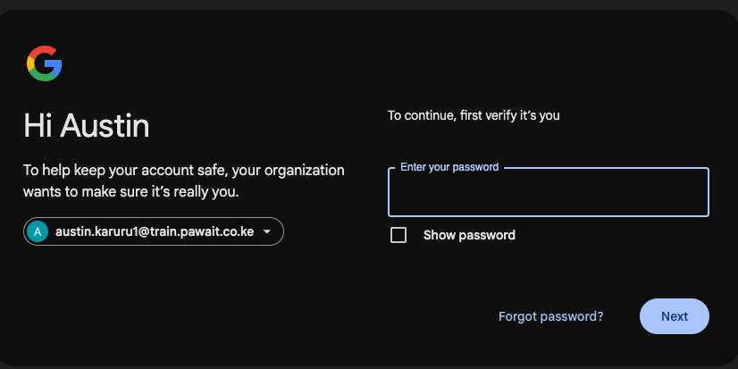
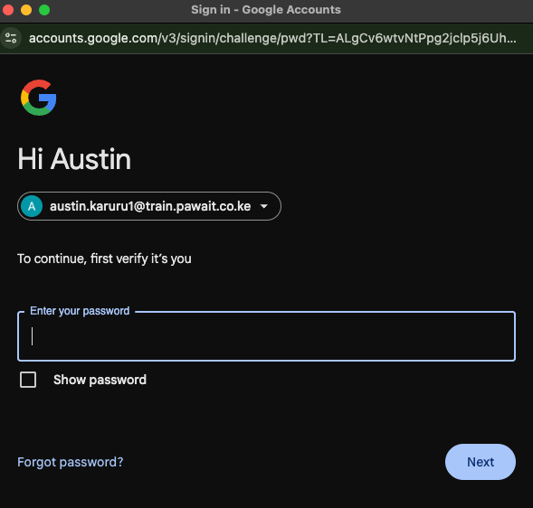
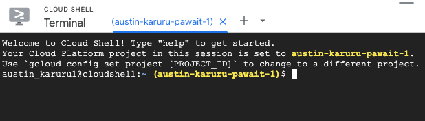

# 1. Prepare the Google Cloud Environment

In this first section, we will log in to the Google Cloud console and set up the Cloud Shell, which will be our primary command-line environment for this training.

## Sign in to Google Cloud Console

1.  Using the credentials provided to you, log in to the Google Cloud console at the following URL: [console.cloud.google.com](https://console.cloud.google.com).

    

2.  After successfully logging in, you should land on the Welcome page of the management console.

    

## Activate Cloud Shell

The Cloud Shell provides a command-line environment directly in your browser, with the `gcloud` SDK and other utilities pre-installed.

1.  Open the Cloud Shell by clicking on the **Activate Cloud Shell** icon in the top-right corner of the console, as highlighted below.

    

2.  A new frame will open at the bottom of your window. Click **Continue** to proceed.

    

3.  You will be prompted to grant Cloud Shell permission to use your account credentials to make API calls to Google Cloud. Click **Authorize**.

    

4.  On some occasions, you may be asked to re-enter your password to continue.

    

## Open Cloud Shell in a New Tab

For a better experience, we will open the Cloud Shell in its own dedicated browser tab.

1.  When the provisioning is complete, your Cloud Shell terminal is ready.

    

2.  Click the **Open in new window** button to launch the Cloud Shell in a new tab.

    

3.  The Cloud Shell will now be open in a new, full-screen browser tab. You may be asked to **Authorize** again.

    

---

**You are now ready for the next section!** Your Google Cloud environment is prepared, and your Cloud Shell is active. In the next section, we will set up the Cloud SQL database.