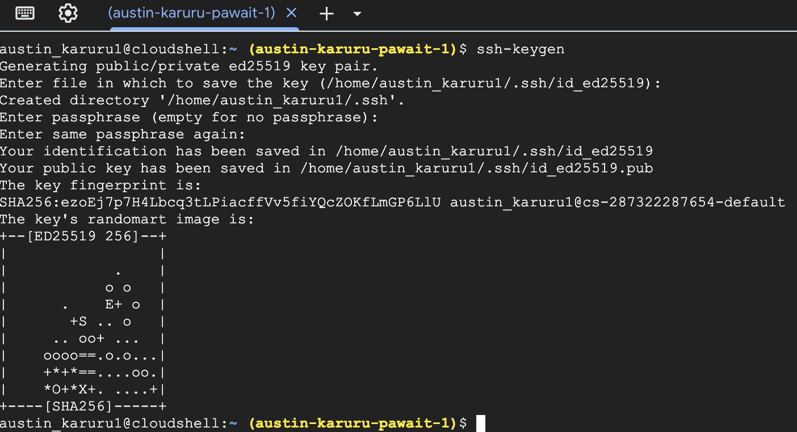
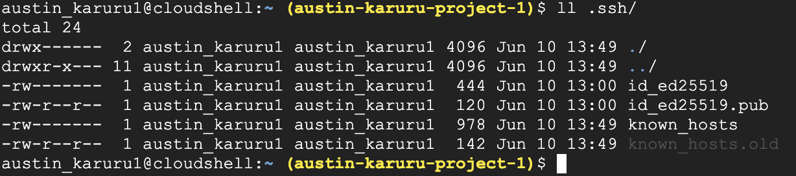
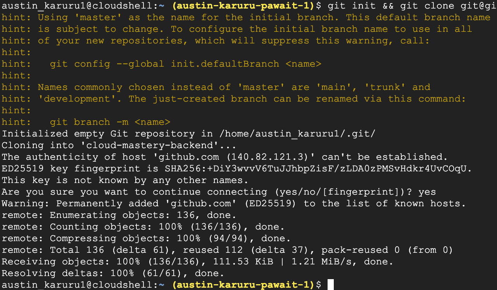

# 3. Prepare GitHub Environment & Backend Repo

For this lab, we will work with two application repositories: `cloud-mastery-backend` and `cloud-mastery-frontend`. First, we need to set up your GitHub account and configure it to work with your Google Cloud Shell environment.

**Do you have a GitHub Account?**
    If you already have a GitHub account, you can skip directly to the **[Fork the Backend Repository](#fork-the-backend-repository)** section.

---

### Create a New GitHub Account (Optional)

1.  Navigate to the GitHub signup page: [github.com/signup](https://github.com/signup).

2.  Fill in your details (email, password, username) to create your account.

    

3.  Complete the "Verify your account" puzzle to prove you're human.

    

4.  GitHub will send a verification code to your email address. Enter this code to confirm your email.

    

5.  Once verified, proceed to sign in. Your new GitHub account is now ready!

    

---

### Fork the Backend Repository

You need your own copy of the application repository to make changes. This is done by "forking" it.

1.  Access the Cloud Mastery backend repository here:
    [https://github.com/Pawa-IT-Solutions/cloud-mastery-backend](https://github.com/Pawa-IT-Solutions/cloud-mastery-backend)

2.  Click the **Fork** button in the top-right corner.

    

3.  On the "Create a new fork" page, you can leave the details as they are and click **Create fork**.

    

4.  You will be redirected to your own forked copy of the repository. It is now ready!

    

---

### Configure Cloud Shell SSH Key

To securely clone the repository to your Cloud Shell, you need to add your Cloud Shell's SSH key to your GitHub account.

1.  Navigate back to your **Google Cloud Shell** tab.

2.  Run the `ssh-keygen` command to generate a new SSH key. Press `Enter` three times to accept the default file location and create a key without a passphrase.

    ```
    ssh-keygen
    ```
    

3.  Verify that the public key file (`id_ed25519.pub`) was created.

    ```
    ls -l .ssh/
    ```
    

4.  Display the public key and copy its entire content to your clipboard.

    ```
    cat .ssh/id_ed25519.pub
    ```
    

5.  Head back to your **GitHub** tab. Click on your profile icon in the top-right corner and select **Settings**.

    
    

6.  In the left navigation menu, click on **SSH and GPG keys**.

    

7.  Click **New SSH key**. Give it a descriptive **Title** (e.g., "Google Cloud Shell") and paste the copied key into the **Key** field. Click **Add SSH key**.

    

---

### Clone the Repository to Cloud Shell

Now you can clone your forked repository.

1.  In GitHub, navigate to your forked `cloud-mastery-backend` repository. Click the green **<> Code** button, select the **SSH** tab, and copy the SSH URL.

    

2.  Go back to your **Cloud Shell** terminal and run the `git clone` command, pasting the URL you just copied.
    Replace the URL with your own forked repository SSH URL

    ```
    git init && git clone git@github.com:austinkaruru1/cloud-mastery-backend.git
    ```

3.  When prompted `Are you sure you want to continue connecting (yes/no/[fingerprint])?`, type `yes` and press `Enter`.

    

4.  Navigate into the newly created directory and list its contents.

    ```
    cd cloud-mastery-backend && ls -l
    ```
    

---

**Great job!** Your GitHub account is configured, and you have successfully cloned the backend application code into your Cloud Shell. Next, we will set up the continuous integration pipeline using Cloud Build.