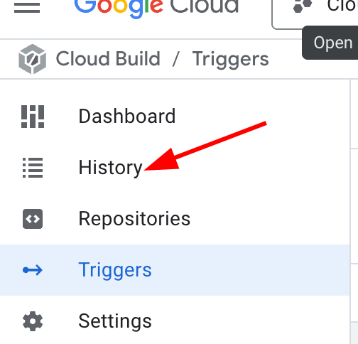
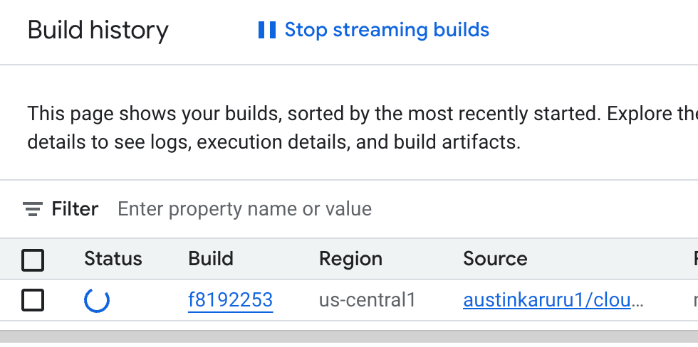

# 4. Setup Cloud Build for the Backend

Now that we have our source code in a GitHub repository, we'll set up a continuous integration (CI) pipeline using Google Cloud Build. This pipeline will automatically build and deploy our backend application to Cloud Run whenever we push changes to the repository.

### Create a Cloud Build Trigger

1.  Navigate to the Google Cloud console. In the top search bar, type `Cloud Build` and select **Triggers** from the results.

    

2.  On the Triggers page, click **Create trigger**.

    

### Configure the Trigger

1.  **Name**: Give your trigger a descriptive name (e.g., `cloud-mastery-backend-deploy`).
2.  **Region**: Select `us-central1 (Iowa)`.
3.  **Event**: Leave as `Push to a branch`.
4.  **Source**:
    *   **Repository**: Click **Connect new repository**.
    
    *   Select **GitHub (Cloud Build GitHub App)** and click **Continue**.
    *   Authorize Google Cloud Build to access your GitHub account.
    
    *   On the GitHub page that opens, select **All repositories** and click **Install**. This allows Cloud Build to see your repos.
    
    *   Back in the Cloud Build UI, select your forked `austinkaruru1/cloud-mastery-backend` repository.
    *   Check the consent box and click **Connect**.
    
5.  **Branch**: Enter `^master$` to trigger builds from the master branch.
6.  **Configuration**:
    *   **Type**: Select `Cloud Build configuration file (yaml or json)`.
    *   **Location**: Leave as `Repository`. The default path `/cloudbuild.yaml` is correct.
7.  **Advanced: Substitution Variables**:
    *   We need to pass the database connection string as a secret to our build.
    *   Click **Add variable**.
    *   **Variable**: `_MYSQL_PRISMA_URL`
    *   **Value**: This requires the public IP of your Cloud SQL instance. Open a **new tab** and navigate to the [Cloud SQL instances page](https://console.cloud.google.com/sql/instances). Copy the **Public IP address** of your instance.
        
    *   Construct the connection string using the format below, replacing `<INSTANCE_IP_ADDRESS>` with the IP you just copied.
    *   Also replace `<PROJECT-ID>` with your Google Cloud Project ID

        ````
        mysql://student:<PROJECT-ID>@<INSTANCE_IP_ADDRESS>:3306/cloud_mastery?sslmode=require
        ````
        
    *   Paste the complete string into the **Value** field for the `_MYSQL_PRISMA_URL` variable.
        
8.  **Service Account**: In the "Advanced" section, find the Service Account dropdown and select the service account that starts with `cloud-mastery-`. This account has the necessary permissions.

    

9.  Click **Create** to finalize the trigger.

### Make and push changes to Github to trigger Cloud Build Trigger Deployment

1. Now head to back to your Cloud Shell & select on the Pencil icon to open the Editor within Cloud Shell
    
2. Select the File Icon, it looks like 2 A4 Pages
    
3. Proceed to Click on `OPEN FOLDER`
    
4. You should get a prompt to Open Folder, and select `OK`
    
5. The editor will now open your Cloud Mastery backend Folder.
6. We can now proceed to make a change to our README.md file, so that we can push the changes to trigger the build.
7. Select `README.md`
    
8. You can make any change to any line that starts with `#`
9. Once done, just go back to your Cloud shell, it should be at the bottom of the screen.
10. Run the following commands in the specified sequence

    ```bash
    cd ~/cloud-mastery-backend
    git config --global user.email "firstname.lastname1@train.pawait.co.ke"
    
    git config --global user.name "First Name Last Name"
    
    git add .
    
    git commit -m "initial commit"
    
    git push origin master
    
    ```
    
11. Runnning these commands will setup your git identity within the cloudshell.
12. You will proceed to add and the commit the changes you have made before pushing to your forked repository.
    

13. Go  to the **History** page within Cloud Build. Click on the running build to view its progress.

    
    

4.  The build will take approximately 7 minutes to complete. Once finished, you should see a "Successful" status.

    

5.  Navigate to **Cloud Run** in the console or use this link: [console.cloud.google.com/run](https://console.cloud.google.com/run). You should now see the `cloud-mastery-backend` service deployed and running.

    

---

**Backend deployment successful!** You have now fully automated the build and deployment process for the backend application. In the next section, we'll repeat this process for the frontend.