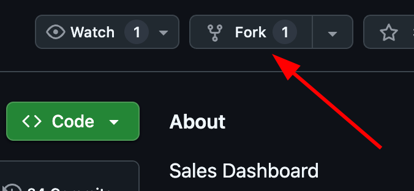
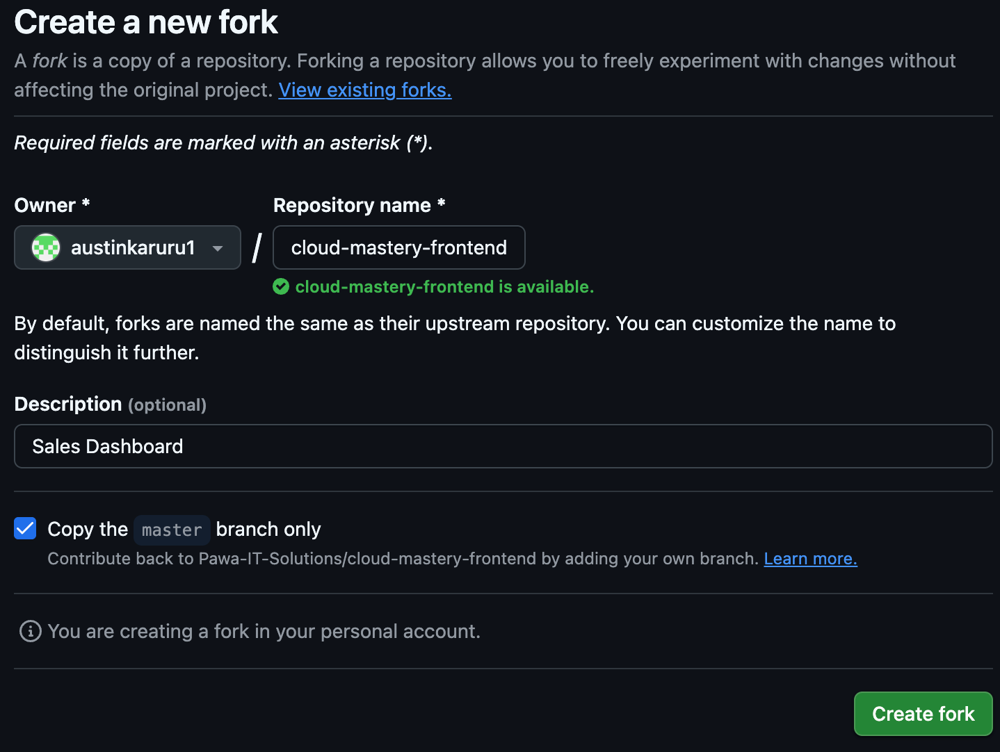
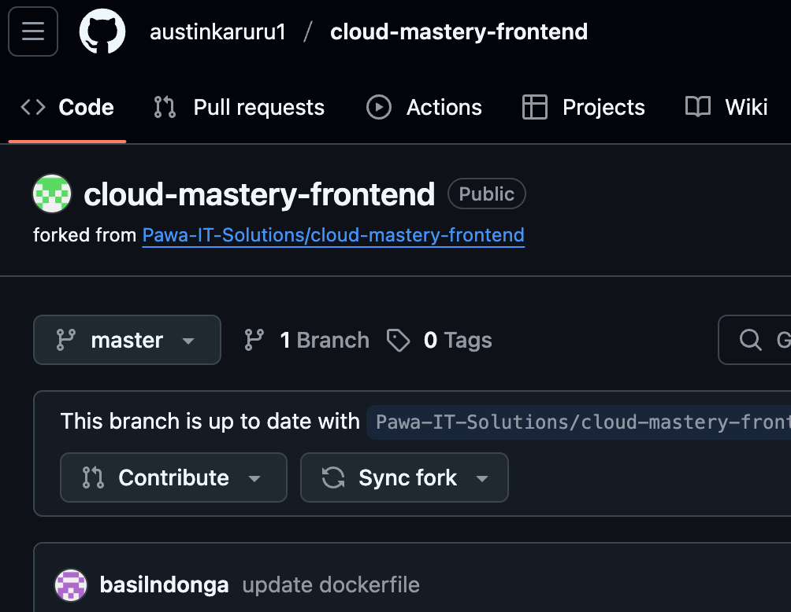
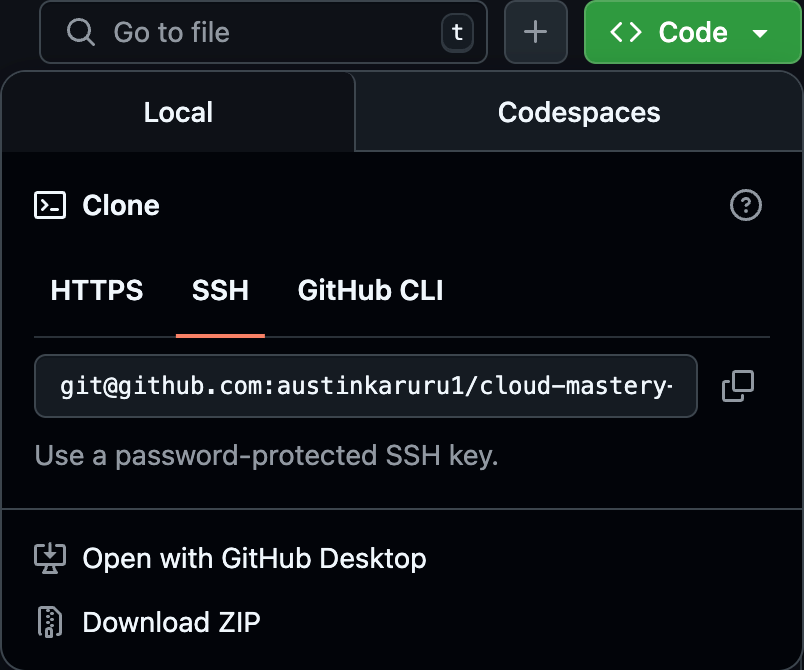
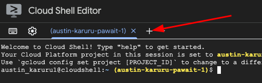
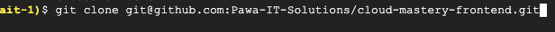
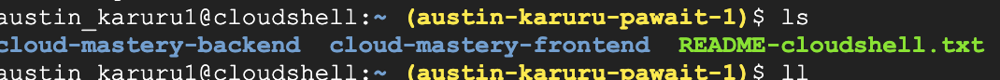

# 5. Setup the Frontend Repository

Now we will repeat the process for the `cloud-mastery-frontend` application. We will fork the repository to our GitHub account and then clone it into our Cloud Shell environment.

### Fork the Frontend Repository

1.  Access the Cloud Mastery frontend repository here:
    [https://github.com/Pawa-IT-Solutions/cloud-mastery-frontend](https://github.com/Pawa-IT-Solutions/cloud-mastery-frontend)

2.  Just like before, click the **Fork** button in the top-right corner.

    

3.  On the "Create a new fork" page, you can accept the default settings and click **Create fork**.

    

4.  You will be redirected to your personal forked copy of the `cloud-mastery-frontend` repository.

    

### Clone the Frontend Repository to Cloud Shell

We will clone the frontend into a separate directory within our Cloud Shell home directory.

1.  In GitHub, navigate to your forked `cloud-mastery-frontend` repository. Click the green **<> Code** button, select the **SSH** tab, and copy the SSH URL.

    

2.  Navigate back to your **Google Cloud Shell** tab. Your current directory should be `~/cloud-mastery-backend`. First, go back to your home directory.

    ```
    cd ~
    ```

    **Working with Multiple Terminals**
        Your document shows opening a new Cloud Shell terminal tab by clicking the `+` icon. This is a great way to manage separate tasks. For this guide, we will perform the clone from the home directory in the same terminal.

    

3.  Run the `git clone` command, pasting the frontend repository's SSH URL you just copied.

    ```shell
    # Replace the URL with your own forked repository SSH URL
    git clone git@github.com:austinkaruru1/cloud-mastery-frontend.git
    ```

    

4.  List the contents of your home directory. You should now see folders for both the backend and frontend repositories.

    ```shell
    ls -l
    ```
    

5.  Navigate into the new frontend directory to confirm the files are there.
    ```shell
    cd cloud-mastery-frontend && ls -l
    ```

---

**Frontend repository is ready!** You now have the source code for both the backend and frontend applications in your Cloud Shell. Next, we will create the Cloud Build trigger to automate the deployment of the frontend.