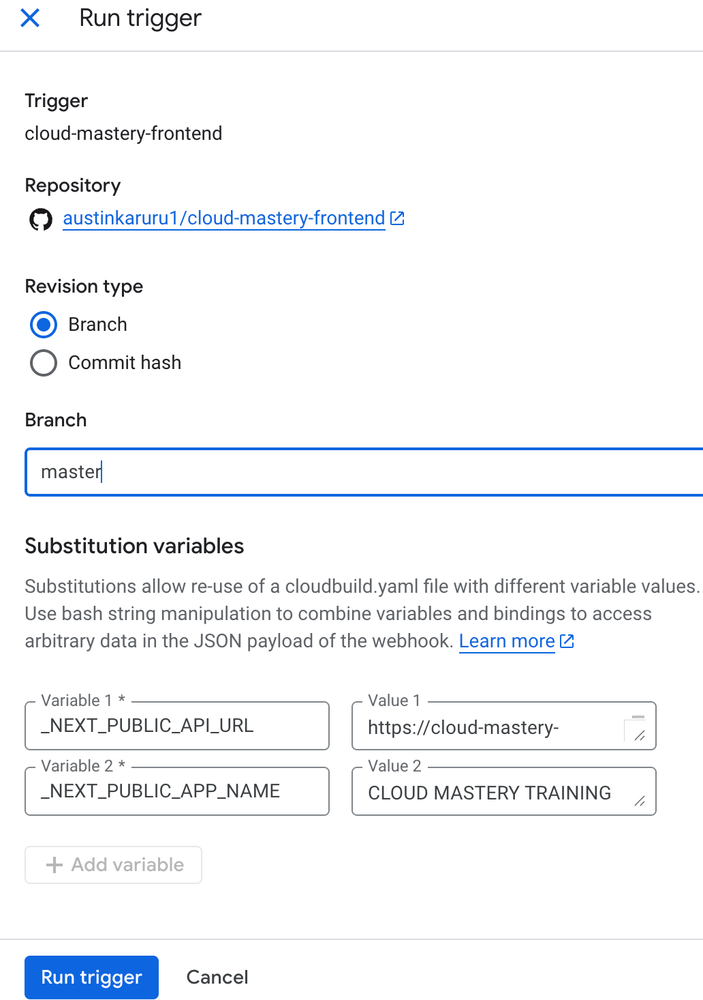
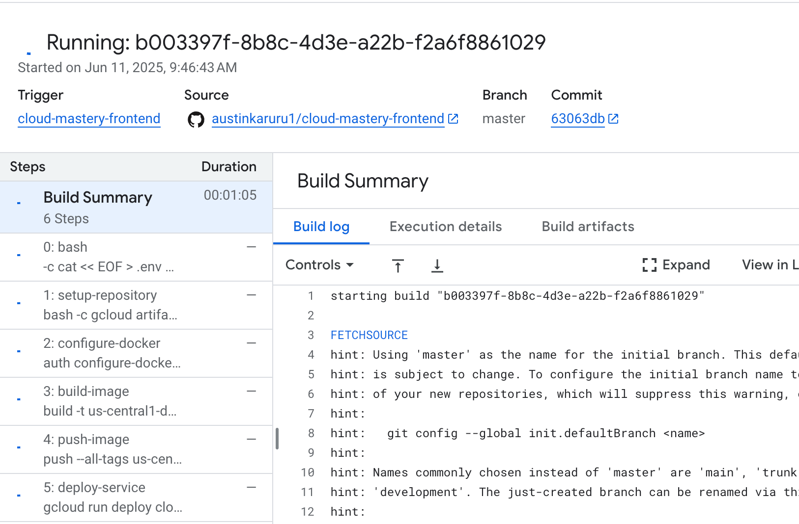
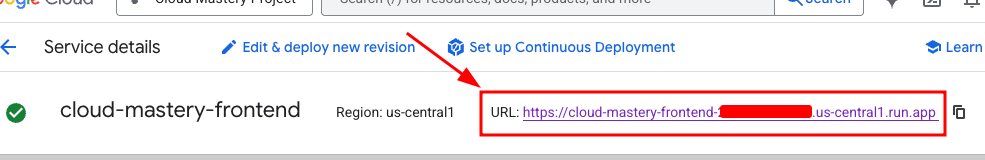
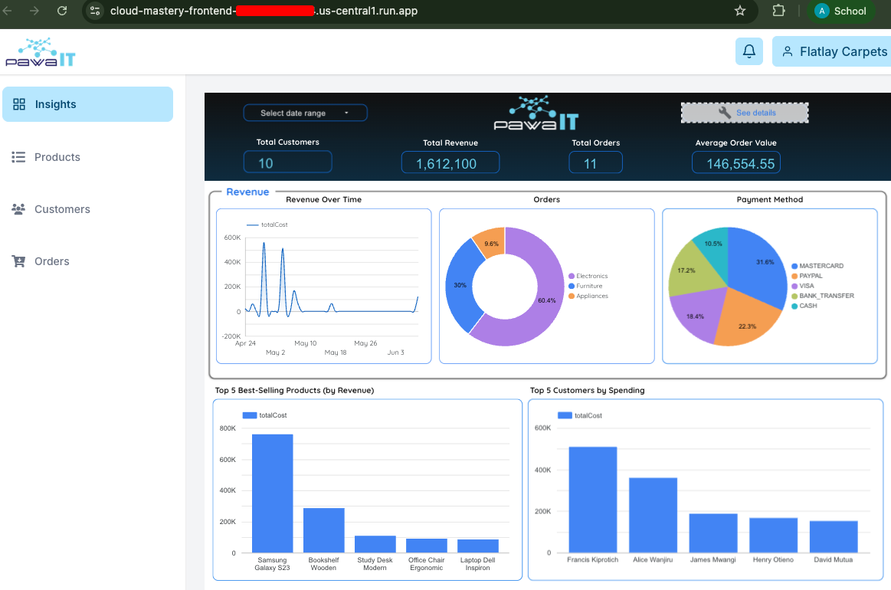

# 7. Run the Build & Access the Application

This is the final step. We will manually run our newly created frontend trigger, which will build the frontend application and deploy it to Cloud Run. Once complete, we can access the public URL to see our live dashboard.

### Run the Frontend Trigger

1.  From the Cloud Build **Triggers** list, find your `cloud-mastery-frontend-deploy` trigger and click **Run**.
2.  In the popup, confirm the branch name (`master`) and click **Run trigger**.

    

### Monitor the Build and Access the Application

1.  You will be taken to the **History** page. Click on the running build to monitor its progress.
2.  Like the backend, this build will take approximately 7 minutes.

    

3.  Once the build completes successfully, you are ready to see the application!

    

4.  Navigate to the **Cloud Run** page in the console.

5.  Click on the **`cloud-mastery-frontend`** service.

6.  At the top of the service details page, you will see the primary URL for the application. Click on it to open it in a new tab.

    

7.  You should now see the fully deployed application dashboard!

    

---

### Congratulations!

You have successfully built and deployed a full-stack, database-driven application on Google Cloud.

Throughout this lab, you have:
-   Prepared a Google Cloud environment and used the Cloud Shell.
-   Populated a managed Cloud SQL database.
-   Forked repositories and configured GitHub with SSH for secure access.
-   Built two separate CI/CD pipelines with Cloud Build.
-   Passed secrets to the build process using substitution variables.
-   Deployed both backend and frontend services to Cloud Run.