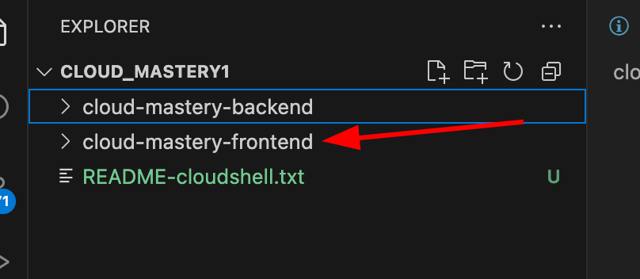

# 7. Run the Build & Access the Application

This is the final step. We will make a change in the cloud mastery frontend repo and push the change, which will build the frontend application and deploy it to Cloud Run. Once complete, we can access the public URL to see our live dashboard.

### Run the Frontend Trigger

1. Back on the Editor, you will see on the `EXPLORER` another directory named cloud-mastery-frontend.
 
2. Just like before, select your README.md file under the `cloud-mastery-frontend` folder.
 

5. Navigate to the **History** page within Cloud Build. Click on the running build to monitor its progress.
6. This build will take less time compared to the cloud mastery backend build.

    

7. Once the build completes successfully, you are ready to see the application!

    

8. Navigate to the **Cloud Run** page in the console.

9. Click on the **`cloud-mastery-frontend`** service.

10. At the top of the service details page, you will see the primary URL for the application. Click on it to open it in a new tab.

    

11. You should now see the fully deployed application dashboard!

    

---

### Congratulations!

You have successfully built and deployed a full-stack, database-driven application on Google Cloud.

Throughout this lab, you have:

-   Prepared a Google Cloud environment and used the Cloud Shell.
-   Populated a managed Cloud SQL database.
-   Forked repositories and configured GitHub with SSH for secure access.
-   Built two separate CI/CD pipelines with Cloud Build.
-   Passed secrets to the build process using substitution variables.
-   Deployed both backend and frontend services to Cloud Run.