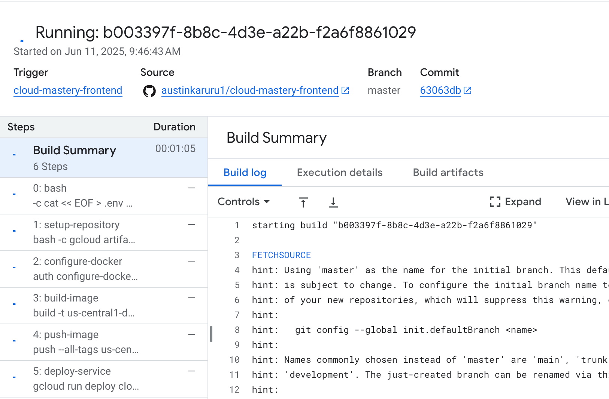

# 7. Deploy the Frontend and Access Your Application

This is the final step where everything comes together. We will trigger the deployment for our frontend application the same way we did for the backend. Once the pipeline succeeds, we will access the public URL to see our live, fully-functional dashboard.

## Trigger the Frontend Deployment

Let's make a final code push to trigger the frontend build pipeline.

1.  In the Cloud Shell Editor's **EXPLORER** pane, you will see the `cloud-mastery-frontend` directory.
    

2.  Expand the `cloud-mastery-frontend` folder and click on its `README.md` file to open it.
    

3.  Make a small change to this file, just as you did for the backend. When you're done, return to the Cloud Shell terminal.

4.  Now, run the following commands to push your change to GitHub.

    !!! info "Just Like Before"
        This process is identical to what we did for the backend. We navigate to the correct folder, add our changes, commit them, and push to the `master` branch to trigger our build.

    ```bash
    # IMPORTANT: Navigate to the frontend directory first!
    cd ~/cloud-mastery-frontend

    # Add, commit, and push the changes
    git add .
    git commit -m "Deploy frontend application"
    git push origin master
    ```
    Your push will now trigger the `cloud-mastery-frontend-deploy` pipeline.
    

## Monitor the Build and Verify Deployment

1.  Navigate back to the Cloud Build **History** page in the Google Cloud Console. You will see the new build for the frontend running.

    !!! note "Faster Build Time"
        You'll notice this build completes much faster than the backend build, as it doesn't involve database migrations.

    

2.  Once the build shows a green **Successful** status, your frontend is officially deployed!
    

## Access Your Live Application

This is the moment of truth! Let's view the live application.

1.  In the Google Cloud Console, navigate to the **Cloud Run** page.

2.  Click on the **`cloud-mastery-frontend`** service to open its details.

3.  At the top of the service details page, you'll find the application's public **URL**. Click on it to open your dashboard in a new tab.
    

4.  Behold your fully deployed application dashboard!
    

---

!!! success "Congratulations! Project Complete!"
    You have successfully built and deployed a full-stack, database-driven application on Google Cloud using modern, automated practices.

    Throughout this lab, you have accomplished a great deal:

    -   Prepared a Google Cloud environment and mastered the Cloud Shell.
    -   Provisioned and populated a managed Cloud SQL database.
    -   Forked repositories and configured GitHub with SSH for secure access.
    -   Built two separate CI/CD pipelines with Cloud Build for automated deployments.
    -   Passed secrets securely to the build process using substitution variables.
    -   Deployed both backend and frontend containerized services to Cloud Run.

---
<div class="page-nav">
  <div class="nav-item">
    <a href="../setup-frontend-pipeline/" class="btn-secondary">← Previous: Setup Frontend Pipeline</a>
  </div>
  <div class="nav-item">
    <span><strong>Section 19</strong> -  Access the application </span>
  </div>
  <div class="nav-item">
    <a href="../data-analytics-lab/" class="btn-primary">Next: Analytics Lab →</a>
  </div>
</div>

---