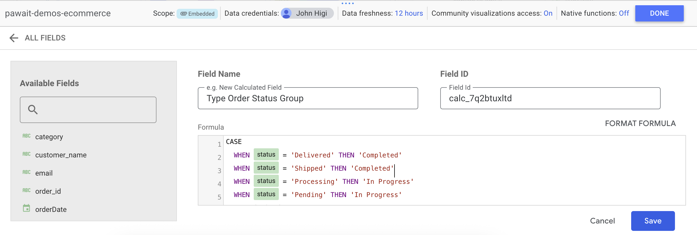
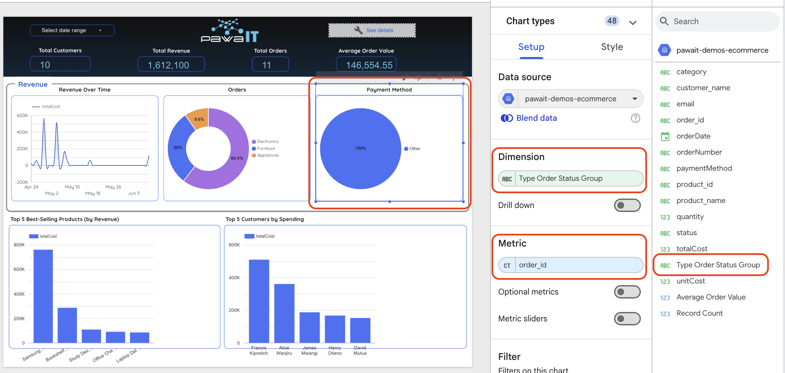

# GCP Data Pipeline: MySQL to BigQuery to Looker Studio

This guide walks you through creating a data pipeline that extracts data from a MySQL database, transforms and loads it into BigQuery using a Cloud Run function, schedules this process with Cloud Scheduler, and finally visualizes the data in Looker Studio.

## Part 1: Creating the BigQuery Dataset and Table

A Dataset in BigQuery is like a database or a schema; it's a container for your tables. A Table contains your actual data, organized into rows and columns with a defined schema.

### Step 1: Create a BigQuery Dataset

1.  **Navigate to BigQuery:**
    *   In the Google Cloud Console, open the navigation menu (☰).
    *   Scroll down to the **BigQuery** section and click on **Studio**.

    

2.  **Select Your Project:**
    *   In the **Explorer** panel on the left, find and click on your Google Cloud project name.

3.  **Initiate Dataset Creation:**
    *   Click the three-dot menu (⋮) next to your project ID.
    *   Select **Create dataset**.

4.  **Configure the Dataset:**
    *   **Dataset ID:** Enter a unique name for your dataset. This name will be part of your table IDs (e.g., `cloud_mastery`).
    *   **Data location:** Select the geographic location where your data will be stored (e.g., `us-central1` for a region or `US` for a multi-region).
        !!! important
            You cannot change the location after creation. Choose a location close to your other services (like your Cloud Function) to optimize performance and cost.
    *   Leave other settings as default for now. Click the **CREATE DATASET** button.
        Your new dataset will now appear under your project in the Explorer panel.

### Step 2: Creating a BigQuery Table

Now that you have a dataset, you can create a table inside it using the Console Interface (Visual Builder) to create an empty table where you will load data later.

1.  **Select Your Dataset:**
    *   In the **Explorer** panel, find the dataset you just created (e.g., `cloud_mastery`).
    *   Click the three-dot menu (⋮) next to your dataset name.
    *   Select **Create table**.

    

2.  **Configure the Table:**
    This will open the "Create table" configuration page.
    *   **Source:** For "Create table from", keep the default **Empty table**.
    *   **Destination:**
        *   Project and Dataset will be pre-filled.
        *   **Table name:** Enter a name for your table (e.g., `denormalized_orders`).

    

    *   Click **CREATE TABLE**.

Your new empty table will now appear under its dataset. To view your table name, click on your **table name** in your dataset on the left panel, then click on **Details** at the top. Finally, copy your **Table ID** to be used in the next session.


## Part 2: Creating the Cloud Function

### Prerequisites

Before you begin, ensure you have the following ready:

1.  **Google Cloud Project:** A project with billing enabled.
2.  **Enabled APIs:** Make sure the following APIs are enabled in your project. You can enable them by searching for them in the console's search bar and clicking "Enable".
    *   Cloud Functions API
    *   Cloud Build API
    *   Artifact Registry API
    *   BigQuery API
3.  **Source MySQL Database:** This guide will focus on connecting to a Cloud SQL instance. The credentials will be provided to you.
    *   `DB_USER`: `student`
    *   `DB_PASS`: your project name (e.g. `john-doe-pawait-1`)
    *   `DB_NAME`: `cloud_mastery`
    *   `DB_HOST`: your cloudsql instance public ip (e.g. `34.136.216.83`)
4.  **BigQuery Table:** You need an existing BigQuery Dataset and table where the pipeline will load the data from our first step.
    *   `BQ_TABLE_ID`: `your-project-id.your_dataset_name.your_table_name` (e.g., `john-higi-pawait-1.john_higi_pawait_1.cloud_mastery`)

### Step 1: Prepare Your Code Files

Your Cloud Function needs two files: `main.py` (our function's logic) and `requirements.txt` (its dependencies).

1.  **`main.py`**
    *   Copy the code snippet and paste it in the `main.py` file.

    ```python
    main.py
    import os
    import pandas as pd
    import pymysql
    from google.cloud import bigquery

    def denormalize_and_load(request):
        db_user = os.environ['DB_USER']
        db_pass = os.environ['DB_PASS']
        db_name = os.environ['DB_NAME']
        db_host = os.environ['DB_HOST']
        table_id = os.environ['BQ_TABLE_ID']

        query = """
        SELECT
            o.id AS order_id,
            o.orderNumber,
            CONCAT(c.firstName, ' ', c.lastName) AS customer_name,
            c.email,
            o.orderDate,
            od.product_id,
            p.name AS product_name,
            p.category,
            od.quantity,
            od.unitCost,
            od.totalCost,
            o.status,
            o.paymentMethod
        FROM orders o
        JOIN customers c ON o.customer_id = c.id
        JOIN order_details od ON o.id = od.order_id
        JOIN products p ON od.product_id = p.id
        """

        connection = pymysql.connect(
            host=db_host,
            user=db_user,
            password=db_pass,
            database=db_name,
            port=3306,
            cursorclass=pymysql.cursors.DictCursor
        )

        try:
            with connection.cursor() as cursor:
                cursor.execute(query)
                results = cursor.fetchall()
        finally:
            connection.close()

        df = pd.DataFrame(results)

        # Explicitly cast date/time columns if necessary, BigQuery auto-detects often
        if 'orderDate' in df.columns:
            df['orderDate'] = pd.to_datetime(df['orderDate'])

        client = bigquery.Client()
        job_config = bigquery.LoadJobConfig(
            write_disposition=bigquery.WriteDisposition.WRITE_TRUNCATE,
            autodetect=True # Set to False if you want to provide a schema
        )

        job = client.load_table_from_dataframe(df, table_id, job_config=job_config)
        job.result()  # Wait for the job to complete

        return f"Loaded {len(df)} rows to {table_id}."
    ```

2.  **`requirements.txt`**
    *   This file lists the Python libraries your function needs. Copy the code snippet and paste it in the `requirements.txt`.

    ```text
    functions-framework==3.*
    pandas==2.2.2
    PyMySQL==1.1.0
    google-cloud-bigquery==3.21.0
    # SQLAlchemy and pyarrow might not be strictly needed for this specific script
    # but were in the original requirements. Add if other parts of your code use them.
    # SQLAlchemy==2.0.30
    # pyarrow==20.0.0
    ```
    !!! note
        The code will also be available to you in the cloud mastery github repo (link should be provided here).

### Step 2: Navigate to Cloud Run functions (for Functions)

1.  In the Google Cloud Console, search for "cloud run functions".

    

### Step 3: Create the Cloud Run Function

1.  Click on **[...] Write a function** at the top of the page.

    

2.  You will be taken to the function configuration page.
   

### Step 4: Configure the Function Basics

Fill out the first section with the following details and leave default for those not included in the list below:

*   Leave the default **Use an inline editor to create a function** option selected.
*   **Service name:** Give your function a descriptive name (e.g., `cloud-mastery`). Service name may only start with a letter and contain up to 49 lowercase letters, numbers, or hyphens.
*   **Region:** `us-central1` (Iowa) (or your preferred region, matching BigQuery dataset is good).
*   Select **Source code inline** if not already selected.
*   **Runtime:** Python 3.13 (or your preferred compatible Python version, e.g., 3.9, 3.10, 3.11, 3.12).
*   **Authentication:** For easy testing, select **Allow unauthenticated invocations**.

    !!! warning "Security Warning"
        For a production environment, you should always use "Require authentication" and set up a secure way to call the function (e.g., using Cloud Scheduler with an OIDC token).

*   Expand the **Containers, Volumes, Networking, Security** section.
*   Select the **Containers** tab if not already selected.
*   Under **Build configuration**, ensure **Source code** is set to **Source code inline**.
*   Scroll down to **Runtime Environment Variables** under "Container(s) > Edit Container". Click on **Variables & Secrets**.

    **Runtime Environment Variables:**
    *   Click **ADD VARIABLE**. You will add a variable for each piece of configuration your code needs.
        *   `DB_USER`: Your MySQL database username (e.g., `student`)
        *   `DB_PASS`: Your MySQL database password (e.g., `john-doe-pawait-1`). Note: For production, it is highly recommended to use Secret Manager.
        *   `DB_NAME`: The name of your MySQL database (e.g., `cloud_mastery`)
        *   `DB_HOST`: The public IP address of your Cloud SQL instance.
        *   `BQ_TABLE_ID`: The full ID for your BigQuery table in the format `your-project-id.your_dataset_name.your_table_name`.

    

*   Click on the **Security** tab (within "Containers, Volumes, Networking, Security").
*   **Service account:** Select the provided Service account (e.g., `Infra - SA - john-higi-1`). 

    

*   Leave the rest as default and click  Create

### Step 5: Configure Code and Runtime (Inline Editor)

This is where you'll provide your code and define the environment.

1.  **Provide the Code:**
    *   In the `main.py` tab, paste the full Python code from Step 1.
    *   Click on the `requirements.txt` tab and paste the dependencies.

    

2.  **Function entry point:** This must match the name of the function in your Python code. Enter `denormalize_and_load`.
3.  Click **Save and redeploy** (or similar button like "Deploy").

4.  Deployment will take a few minutes. You can monitor the progress. Once completed and deployed successfully, you should get all Green checks and a URL provided for your function. Clicking on this URL will trigger the function.

    

    You can test the function by navigating to its URL in a browser or using a tool like `curl`.

## Part 3: Creating the Cloud Scheduler

### Prerequisites

1.  **Deployed Cloud Function:** Your function must be deployed and working correctly when tested manually.
2.  **Cloud Scheduler API Enabled:** Ensure the Cloud Scheduler API is enabled in your project.

### Step 1: Navigate to Cloud Scheduler

1.  In the Google Cloud Console, search for "cloud scheduler" OR open the navigation menu (≡), scroll down to the **Tools** section (or it might be under "Serverless" or "Integration Services") and click on **Cloud Scheduler**.

    

### Step 2: Create the Scheduler Job

Click the **+ CREATE JOB** button to fill in the configuration details.


1.  **Define the job:**
    *   **Name:** Give the job a descriptive name, like `mysql-to-bq-etl-5min`.
    *   **Region:** Select the **same region** as your Cloud Function. This minimizes latency and cost.
    *   **Description:** (Optional but recommended) Add a short note about what the job does, e.g., "Runs the MySQL to BigQuery ETL function every 5 minutes."

2.  **Define the frequency:**
    *   **Frequency:** Enter the schedule using cron syntax. For "every 5 minutes," use: `*/5 * * * *`
    *   **Timezone:** Select your desired timezone (e.g., East Africa Time (EAT) or UTC).

3.  **Configure the execution:**
    This is the most important part, where you tell the scheduler what to run.
    *   **Target type:** Select **HTTP**.
    *   **URL:** Paste the Cloud Function Trigger URL you copied after deploying the cloud function (e.g. `https://cloud-mastery-1028511169025.us-central1.run.app`).
    *   **HTTP method:** Select **POST**. (While GET often works for simple triggers, POST is more conventional for requesting an action, especially if your function might expect a body in the future).
    *   **Auth header:** If you configured your Cloud Function to "Require authentication", select **Add OIDC token**.
        *   **Service account:** Select the service account that has permission to invoke the Cloud Run function (e.g., a service account with "Cloud Run Invoker" role for that specific function).
        *   **Audience:** If not auto-filled, this is usually the same as the function's trigger URL.
    *   If you selected "Allow unauthenticated invocations" for the function, set Auth header to **None**.

Finally, click **CREATE**.

### Step 3: Test and Verify the Job

You don't have to wait 5 minutes to see if it works. You can force an immediate run.

1.  You will be returned to the Cloud Scheduler dashboard.
2.  Find your newly created job in the list.
3.  On the far right, click the **three-dot menu (⋮)** and select **Force run**.

**How to check if it worked:**

1.  **Check the Scheduler Log:** In the job list, look at the **Result** column. It should change from "Never run" to "Success" within a few seconds. If it says "Failed," click on the job and then the **LOGS** tab to see the error (a common error is 403 PERMISSION_DENIED, which usually means the service account permissions are missing or the Audience for OIDC token is incorrect).
2.  **Check the Cloud Function Log:**
    *   Navigate back to your Cloud Function's details page in Cloud Run.
    *   Go to the **LOGS** tab.
    *   You should see new log entries showing that the function started and completed successfully, including your print() message (e.g., `Loaded X rows...`).
3.  **Check BigQuery:**
    *   Navigate to the BigQuery console and check your table. The "Last modified" time should reflect the time you forced the run, and the data should be present.

## Part 4: Setting up Looker Studio

### Prerequisites

1.  **Looker Studio Account:** You need to have access to Looker Studio ([lookerstudio.google.com](https://lookerstudio.google.com)).
2.  **Existing BigQuery Table:** Your `denormalized_orders` table (or similar) must exist in BigQuery and contain data.
3.  **An Existing Dashboard to Copy:** You need a dashboard to use as a template. For our session, we will use the dashboard embedded on the app. (e.g., a shared template link: `Cloud mastery dashboard`).

### Part 1: Make a Copy of the Dashboard & Link it to BigQuery

This process combines copying the report and connecting it to your new data source in one flow.

1.  **Open the Dashboard:** Navigate to the Looker Studio report you want to copy.
2.  **Make a Copy:**
    *   In the top-right corner, click the **three-dot menu (⋮)**.
    *   Select **Make a copy**.

    

3.  **Configure the New Data Source:**
    *   A new window titled "Copy this report" will appear. This is the most important step. It shows the report's original data sources and prompts you to choose a new one.
    *   Under the **New Data Source** column, click on the current data source to change it.
    *   A panel will open to select a data source. At the bottom, click **CREATE DATA SOURCE**.

    

4.  **Connect to BigQuery:**
    *   In the list of Google Connectors, select **BigQuery**.

    

    *   Your projects will be listed. Select the project containing your data (e.g., `pawa0Alpha` or your project).
    *   Next, select the **Dataset** you created (e.g., `pawait_demos` or your `cloud_mastery` dataset).
    *   Finally, select the **Table** (e.g., `cloud_mastery` if that's your table name, or `denormalized_orders`).
    *   Click the blue **CONNECT** button in the top-right corner.

    

5.  **Confirm the Schema:**
    *   Looker Studio will now show you all the fields (columns) from your BigQuery table and its best guess for their data types (e.g., Number, Text, Date & Time). It's usually very accurate.
    *   Click **ADD TO REPORT** in the top-right corner. (Image for this step is missing, but it's a standard Looker Studio UI element after connecting a data source).
    

6.  **Finalize the Copy:**
    *   You will be back at the "Copy this report" window. Your new BigQuery table should now be listed as the **New Data Source**.
    *   Click **COPY REPORT**.

    **What just happened?** Looker Studio has created a new copy of the dashboard. All the charts will now try to get their data from your `denormalized_orders` table.

    !!! note
        If the field names in your new table don't match the field names used by the original charts, some charts may appear "broken." You'll need to click on each broken chart and manually select the correct fields from your new data source in the **Setup** panel on the right.
    

### Part 2: Add a Calculated Field

Let's create a useful new field without changing our BigQuery table. We'll create a new field called `Order Status Group` that simplifies the status into "Completed," "In Progress," or "Other."
    

1.  **Access the Data Source:**
    *   In the menu at the top of your new report, go to **Resource > Manage added data sources**.
    *   Find your `denormalized_orders` data source in the list and click **EDIT**.

2.  **Create the New Field:**
    *   In the data source editor view, click the blue **+ ADD A FIELD** button in the top-left.

3.  **Configure the Calculated Field:**
    *   A new screen will open. Fill in the details:
        *   **Field Name:** Type `Order Status Group`.
        *   **Formula:** Enter a CASE statement to define the logic. This formula is case-sensitive and must match the values in your status column.

        ```sql
        -- This formula groups detailed statuses into broader categories.
        CASE
            WHEN status = 'Delivered' THEN 'Completed'
            WHEN status = 'Shipped' THEN 'Completed'
            WHEN status = 'Processing' THEN 'In Progress'
            WHEN status = 'Pending' THEN 'In Progress'
            ELSE 'Other'
        END
        ```
    
    *   Looker Studio will show a green checkmark once the formula syntax is valid.
    *   Click **SAVE** in the bottom-right corner.

4.  **Return to the Report:**
    *   Click **DONE** in the top-right corner of the data source editor to go back to your report canvas.
    *   Your new field, `Order Status Group`, is now available to use in any chart.

### Part 3: Add a New Chart Using the Calculated Field

Let's visualize the breakdown of our new status groups with a pie chart.

1.  **Add a Chart to the Canvas:**
    *   In the top menu, click **Add a chart**.
    *   Select **Pie chart** from the dropdown.
    *   Your cursor will turn into a crosshair. Click anywhere on your report canvas to drop the new chart.
    

2.  **Configure the Chart's Data:**
    *   Click on your new pie chart to select it. The **Chart > Setup** panel will appear on the right.
    *   **Data source:** Make sure your `denormalized_orders` source is selected.
    *   **Dimension:** This is what slices up the pie.
        *   Drag your new **Order Status Group** field from the "Available Fields" list on the right and drop it into the "Dimension" box.
    *   **Metric:** This is what determines the size of each slice.
        *   Drag the **order_id** field (or any unique row identifier like `Record Count`) into the "Metric" box. By default, if using `order_id`, it might sum or count. Ensure it's set to **Count Distinct (CTD)** for unique orders, or **Record Count** if you want to count all rows per status group.
    

3.  **Style the Chart (Optional):**
    *   With the chart still selected, click the **Style** tab in the right-hand panel.
    *   Here you can change colors, add a title, change the font, and choose whether to show percentages or values on the slices.
    

---

!!! success 
    You have now successfully copied a dashboard, connected it to your own BigQuery data, enriched it with a custom calculated field, and built a new visualization to gain deeper insights from your data.
---
<div class="page-nav">
  <div class="nav-item">
    <a href="../accessing-the-application/" class="btn-secondary">← Previous: Access the Application </a>
  </div>
  <div class="nav-item">
    <span><strong>Section 11</strong> -  Analytics Lab </span>
  </div>
  <div class="nav-item">
    <a href="../virtual-agent-lab/" class="btn-primary">Next: Virtual Agents Lab →</a>
  </div>
</div>

---