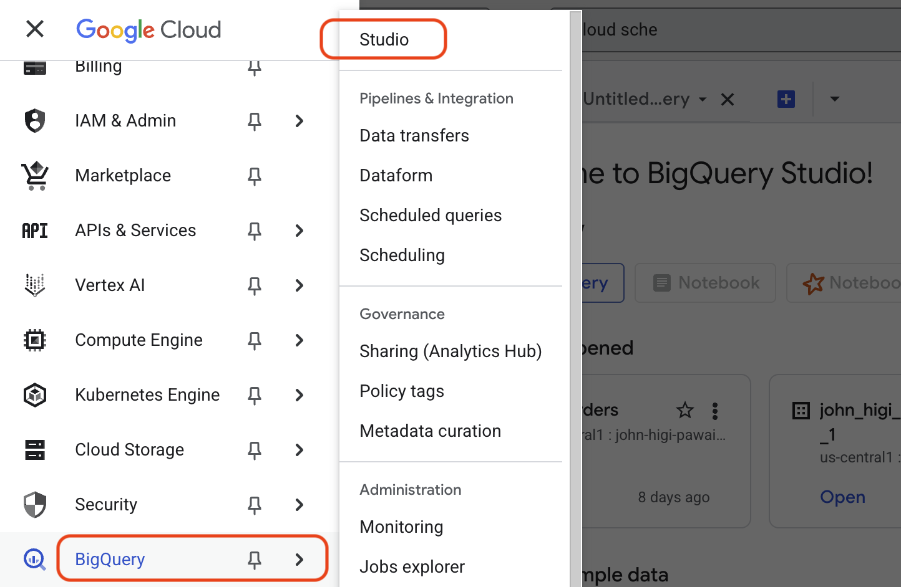
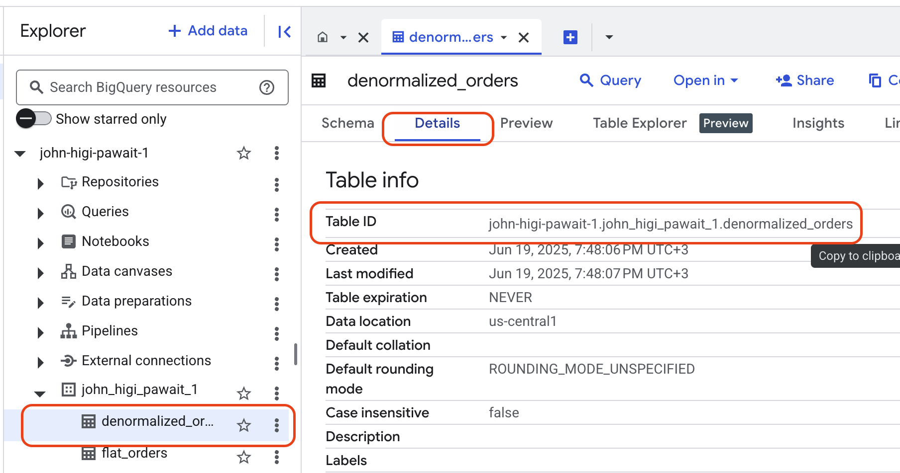

# 1. Setup BigQuery: Dataset and Table

The first step in any data pipeline is to prepare the destination. In our case, this is Google BigQuery. A **Dataset** in BigQuery is a container for your tables (like a database schema), and a **Table** holds your data in rows and columns.

## Step 1: Create a BigQuery Dataset

1.  **Navigate to BigQuery Studio:**
    *   In the Google Cloud Console, open the navigation menu (☰) and select **BigQuery > Studio**.

    

2.  **Initiate Dataset Creation:**
    *   In the **Explorer** panel, click the three-dot menu (⋮) next to your project ID and select **Create dataset**.

3.  **Configure the Dataset:**
    *   **Dataset ID:** `cloud_mastery`
    *   **Data location:** `us-central1` (or your preferred region).
        !!! important
            You cannot change the location after creation. Choose a location close to your other services to optimize performance and cost.
    *   Click **CREATE DATASET**. Your new dataset will now appear under your project in the Explorer panel.

## Step 2: Create a BigQuery Table

Now, let's create an empty table inside your dataset where the pipeline will load data.

1.  **Initiate Table Creation:**
    *   In the **Explorer** panel, click the three-dot menu (⋮) next to your `cloud_mastery` dataset and select **Create table**.

    

2.  **Configure the Table:**
    *   **Source:** Keep the default **Empty table**.
    *   **Destination Table name:** `denormalized_orders`
    *   **Schema**: Leave this blank for now. We will use BigQuery's `autodetect` feature when we load the data.

3.  Click **CREATE TABLE**.

Your new empty table will now appear under its dataset. To view your table name, click on your table in the Explorer, then click on **Details**. Copy the **Table ID** for use in the next section.

!!! success "BigQuery Destination Ready"
    You have successfully created the dataset and table in BigQuery. This structure is now ready to receive data from our pipeline.

## What's Next

With our destination ready, the next step is to build the core of our ETL process: the Cloud Function that will extract data from MySQL and load it into this table.

---

  

    <a href="../data-analytics-lab/" class="btn-secondary">← Previous: Pipeline Overview</a>
  

  

    <strong>Section 21</strong>  - Setup BigQuery
  

  

    <a href="../data-pipeline-create-function/" class="btn-primary"> Next: Create Cloud Function →</a>
  

