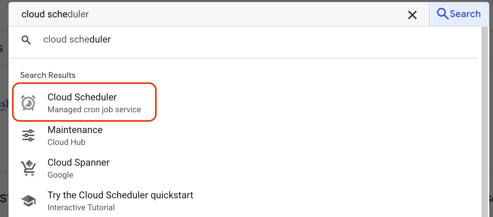
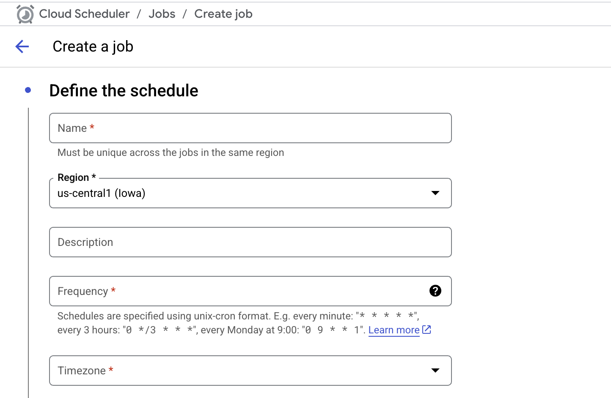

# 3. Schedule the Job with Cloud Scheduler

Now that our ETL function is working, we need to automate it. Cloud Scheduler is a fully-managed cron job service that allows you to schedule tasks, including triggering HTTP endpoints like our Cloud Function.

## Prerequisites

*   A deployed and working Cloud Function.
*   The Cloud Scheduler API enabled in your project.

## Step 1: Create the Scheduler Job

1.  In the Google Cloud Console, search for and navigate to **Cloud Scheduler**.
    

2.  Click **CREATE JOB**.
    

3.  **Define the job:**
    *   **Name:** `mysql-to-bq-etl-5min`
    *   **Region:** `us-central1` (must match your function's region).
    *   **Description:** `Runs the MySQL to BigQuery ETL function every 5 minutes.`
    *   **Frequency:** Enter the schedule using cron syntax. For every 5 minutes, use: `*/5 * * * *`
    *   **Timezone:** Select your desired timezone.

4.  **Configure the execution:**
    *   **Target type:** **HTTP**.
    *   **URL:** Paste the Cloud Function Trigger URL.
    *   **HTTP method:** **GET** (or POST).
    *   **Auth header:** Since we allowed unauthenticated invocations, set this to **None**.

5.  Click **CREATE**.

## Step 2: Test and Verify the Job

You don't have to wait for the schedule to test the job.

1.  On the Cloud Scheduler dashboard, find your new job.
2.  Click the **three-dot menu (⋮)** on the right and select **Force run**.

**How to Verify:**

1.  **Scheduler Log:** The **Result** column for the job should quickly change to "Success".
2.  **Cloud Function Log:** Navigate to your function's logs. You should see a new entry showing a successful execution.
3.  **BigQuery Table:** Go to your `denormalized_orders` table in BigQuery. The "Last modified" time should be updated, and the "Number of rows" should be greater than zero.

## What's Next

Your data pipeline is now fully automated! Data will be refreshed in BigQuery every 5 minutes. The final step is to connect Looker Studio to this data and build a compelling visualization.

---

  

    <a href="../data-pipeline-create-function/" class="btn-secondary">← Previous: Create Cloud Function</a>
  

  

    <strong>Section 23</strong> - Schedule Job
  

  

    <a href="../data-pipeline-visualize-looker/" class="btn-primary">Next: Visualize with Looker Studio →</a>
  

