# 4. Visualize Data with Looker Studio

The final step is to unlock the value in our data by creating an interactive dashboard. Looker Studio (formerly Google Data Studio) is a free tool that turns your data into informative, easy to read, and easy to share dashboards.

## Prerequisites

*   A Looker Studio account ([lookerstudio.google.com](https://lookerstudio.google.com)).
*   Your BigQuery table containing data.
*   An existing dashboard template to copy.

## Step 1: Copy the Dashboard and Connect to Your Data

1.  Open the provided Looker Studio report template.
2.  In the top-right corner, click the **three-dot menu (⋮)** and select **Make a copy**.
    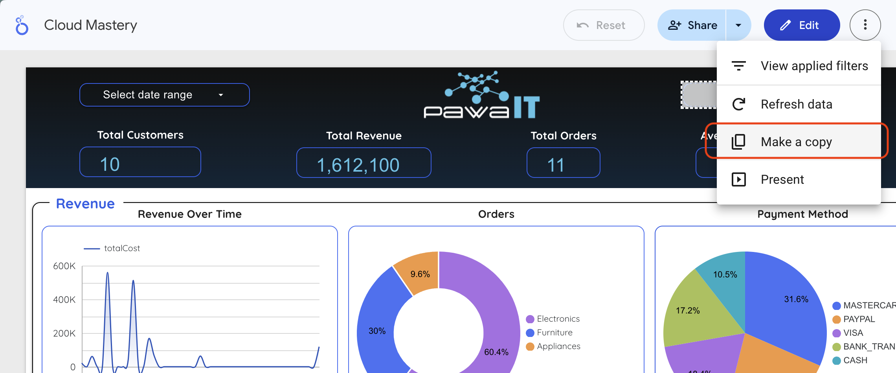
3.  In the "Copy this report" window, under the **New Data Source** column, click the current data source to change it.
    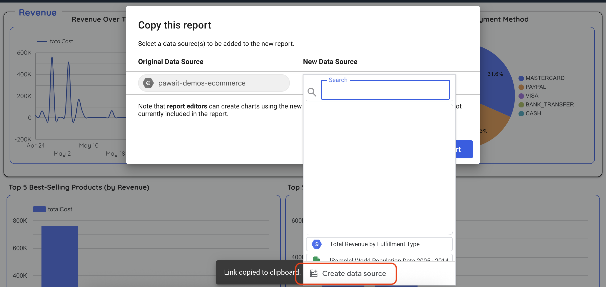
4.  In the panel that opens, click **CREATE DATA SOURCE** at the bottom.
5.  Select the **BigQuery** connector.
    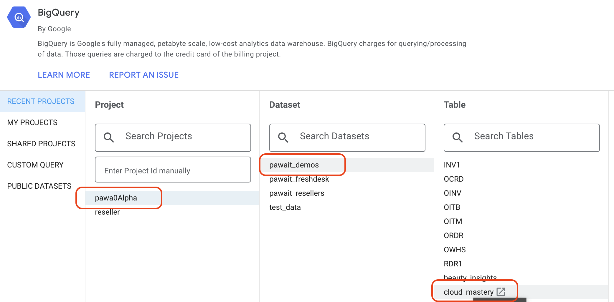
6.  Navigate through the hierarchy: **Your Project** > **`cloud_mastery` Dataset** > **`denormalized_orders` Table**.
7.  Click **CONNECT** in the top-right.
    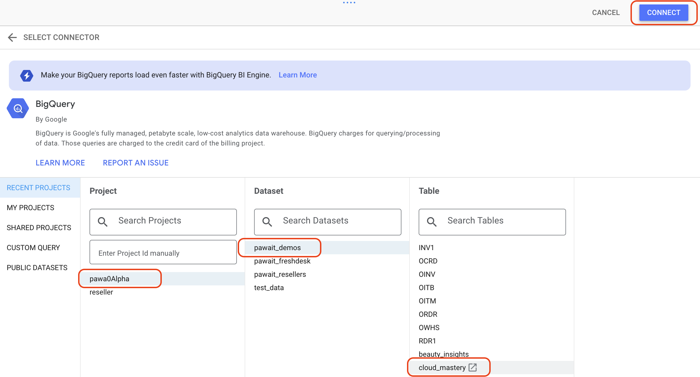
8.  Looker will show you the table schema. Click **ADD TO REPORT**.
    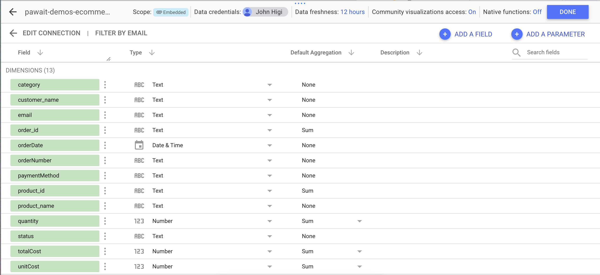
9.  You'll be back at the "Copy this report" window. Confirm your new data source is selected and click **COPY REPORT**.

Your dashboard copy will now load, powered by your own BigQuery data.
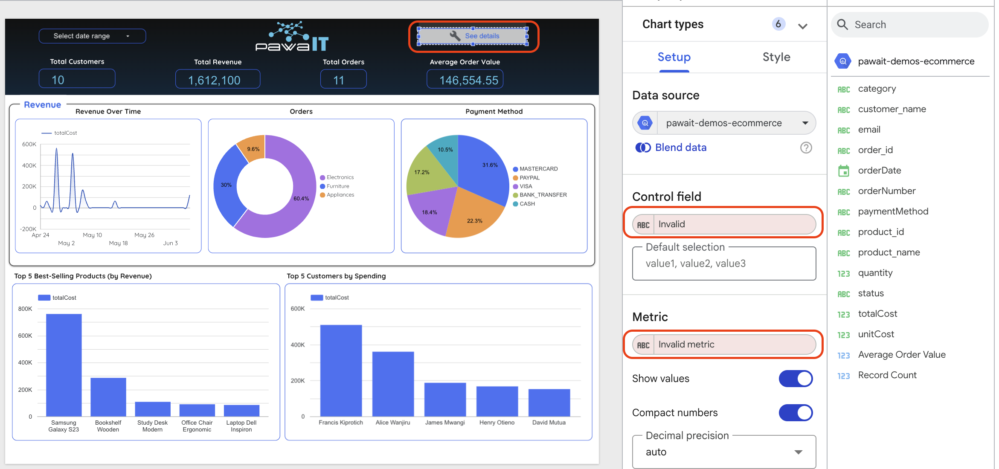

## Step 2: Add a Calculated Field

Let's create a new field directly in Looker Studio without altering our BigQuery table. We'll group detailed order statuses into simpler categories.
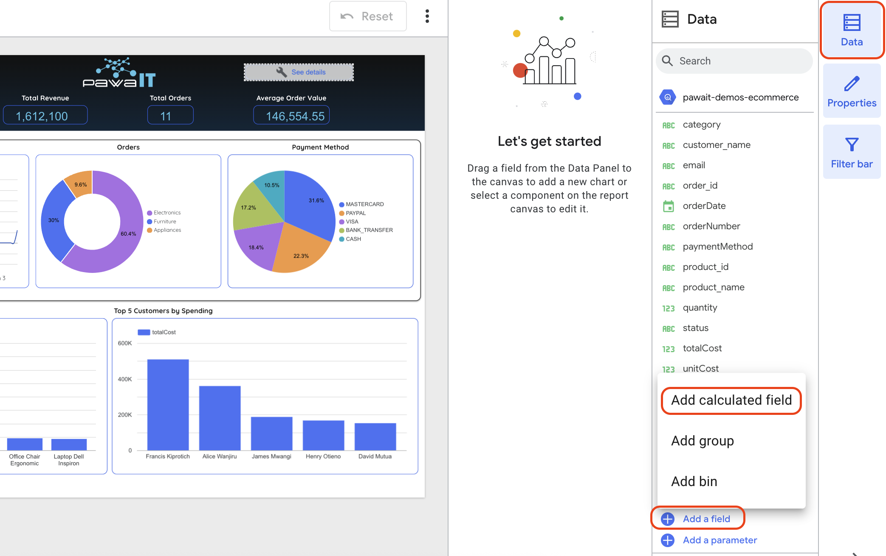

1.  In your new report, go to the menu **Resource > Manage added data sources**.
2.  Find your `denormalized_orders` data source and click **EDIT**.
3.  In the top-left of the data source editor, click **+ ADD A FIELD**.
4.  Configure the new field:
    *   **Field Name:** `Order Status Group`
    *   **Formula:**
        ```sql
        -- This formula groups detailed statuses into broader categories.
        CASE
            WHEN status = 'Delivered' THEN 'Completed'
            WHEN status = 'Shipped' THEN 'Completed'
            WHEN status = 'Processing' THEN 'In Progress'
            WHEN status = 'Pending' THEN 'In Progress'
            ELSE 'Other'
        END
        ```
    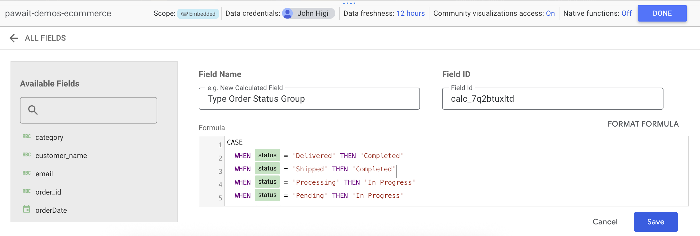
5.  Click **SAVE**. Then click **DONE** in the top-right to return to the report.

## Step 3: Use the Calculated Field in a New Chart

1.  In the top menu, click **Add a chart** and select **Pie chart**.
    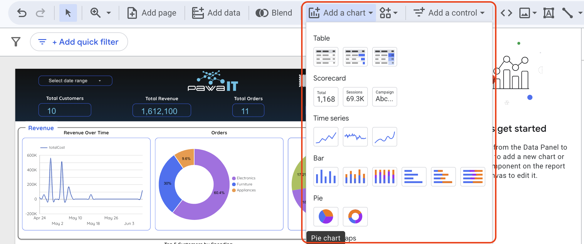
2.  Click on the report canvas to place the chart.
3.  With the new chart selected, configure its **Setup** panel on the right:
    *   **Dimension:** Drag your new **`Order Status Group`** field here.
    *   **Metric:** Drag the **`order_id`** field here and set its aggregation to **Count Distinct (CTD)**.
    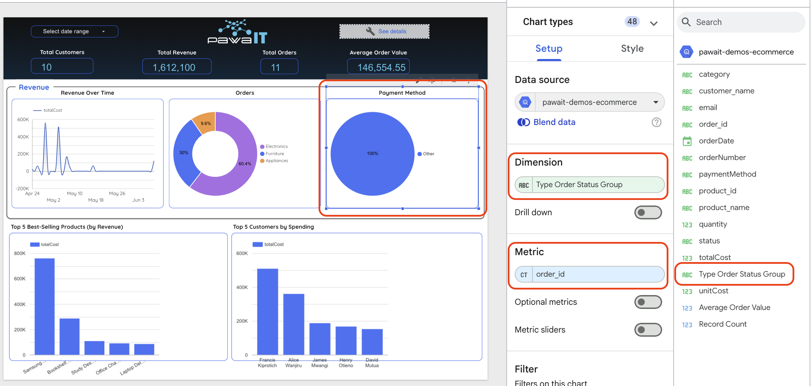
4.  Use the **Style** tab in the right-hand panel to customize its appearance.
    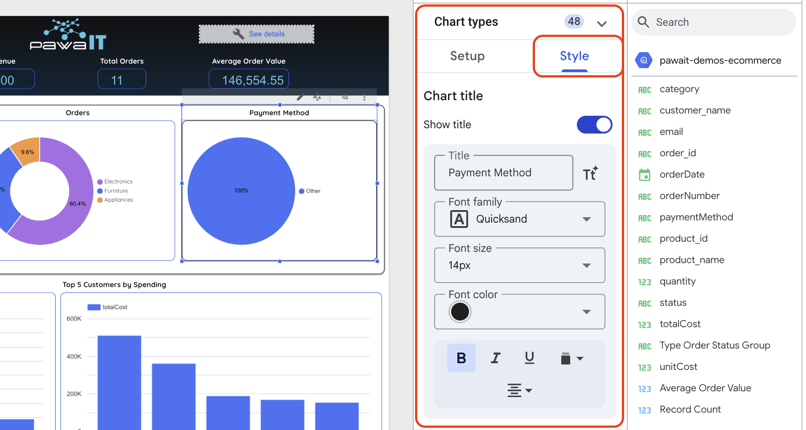

!!! success "Lab Complete!"
    You have successfully built an end-to-end data pipeline, from raw data in MySQL to an automated data warehouse in BigQuery, and finally to an interactive dashboard in Looker Studio.

---

<div class="page-nav">
  <div class="nav-item">
    <a href="../data-pipeline-schedule-job/" class="btn-secondary">← Previous: Schedule Job</a>
  </div>
  <div class="nav-item">
    <span><strong>Section 24</strong> - Visualize Data</span>
  </div>
  <div class="nav-item">
    <a href="../virtual-agent-lab/" class="btn-primary">Next: Virtual Agents Lab →</a>
  </div>
</div>