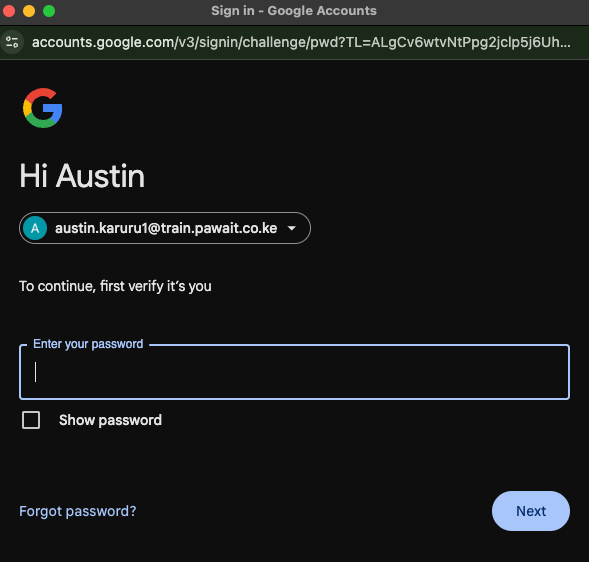

#  Automate Securely: DevOps & CI/CD on GCP Lab
## Overview
Learn DevOps on GCP for automated app updates (CI/CD) and security by building a pipeline and covering GCP security basics.

## What You'll Learn

- Using Cloud Shell to access git repos and edit code
- Setup SSH keys and add public key to Github
- Configuring databases via Cloud SQL
- Setting up CI/CD pipelines with Google Cloud Build
- Pushing docker images to Google Artifact Registry
- Securely injecting application secrets
- Deploying containerized applications to serverless environments
- Embracing Devops Best Practices
- Securing your application within GCP

## Prerequisites

- Active Google account
- Basic understanding of cloud computing concepts
- Basic Linux knowledge
- Basic Git knowledge

### Step 1: Activate Cloud Shell
Cloud Shell provides a command-line environment directly in your browser, with the `gcloud` SDK and other utilities pre-installed.

1.  Open the Cloud Shell by clicking on the **Activate Cloud Shell** icon in the top-right corner of the console, as highlighted below.

    

2.  A new frame will open at the bottom of your window. Click **Continue** to proceed.

    

3.  You will be prompted to grant Cloud Shell permission to use your account credentials to make API calls to Google Cloud. Click **Authorize**.

    

4.  On some occasions, you may be asked to re-enter your password to continue.

    

### Step 2: Open Cloud Shell in a New Tab

For a better experience, we will open the Cloud Shell in its own dedicated browser tab.

1.  When the provisioning is complete, your Cloud Shell terminal is ready.

    

2.  Click the **Open in new window** button to launch the Cloud Shell in a new tab.

    

3.  The Cloud Shell will now be open in a new, full-screen browser tab. You may be asked to **Authorize** again.

    

---

## Next Steps

**You are now ready for the next section!** Your Google Cloud environment is prepared, and your Cloud Shell is active. In the next section, we will set up the Cloud SQL database.

---

  

    <a href="../migration-dns-update/" class="btn-secondary">← Previous: GCP Migration Lab</a>
  

  

    <strong>Section 12</strong> -  DevOps Lab 
  

  

    <a href="../setup-cloud-sql" class="btn-primary">Next: Database Setup →</a>
  

