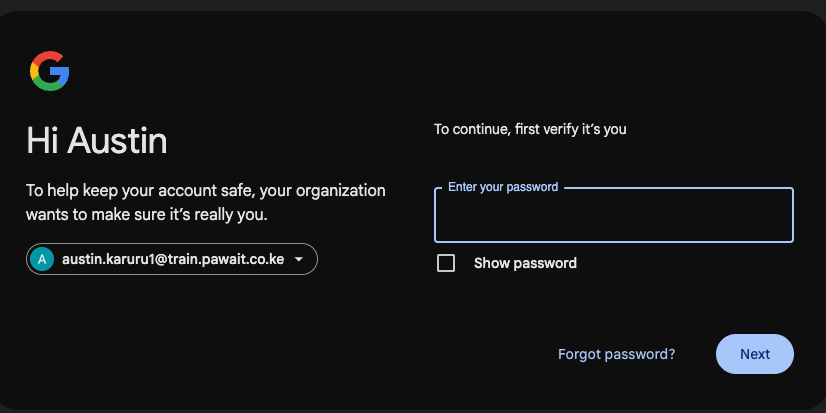
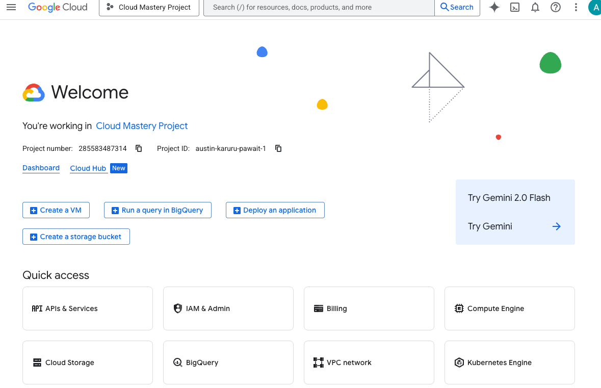

#  GCP Migration Lab
## Overview

In this lab, you'll move a sample on-prem app to Google Cloud using Google tools to migrate, verify data, and compare performance.

## What You'll Learn

- Accessing onprem server via SSH
- Backing up VM images to Google Cloud Storage
- Using **Migrate to virtual Machines** to migrate onprem vm to GCP
- Accessing web app via web interface

## Prerequisites

- Active Google account
- Basic understanding of cloud computing concepts
- Basic linux knowledge

### Step 1: Sign in to Google Cloud Console
In this first section, we will log in to the Google Cloud console and set up the Cloud Shell, which will be our primary command-line environment for this training.
1.  Navigate to the [Google Cloud Console](https://console.cloud.google.com) Using the credentials provided to you.
    
2.  After successfully logging in, you should land on the Welcome page of the management console.
    

---

## Next Steps

Once your GCP environment is ready, proceed to migrate the onprem VM to GCP.

---

  

    <a href="../introduction/" class="btn-secondary">← Previous: Introduction</a>
  

  

    <strong>Section 2</strong> -  GCP Migration Lab 
  

  

    <a href="../migration-overview" class="btn-primary">Next: Application Migration →</a>
  

