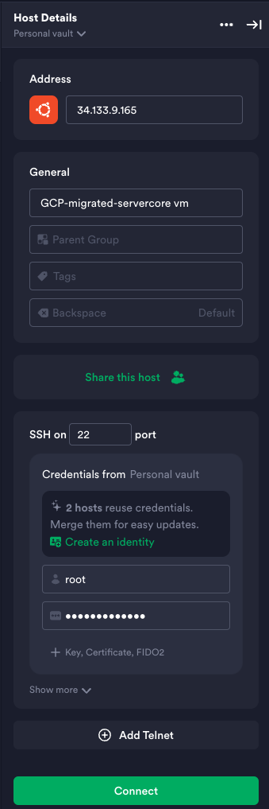

# Access and Configure the Migrated VM

Your migrated virtual machine is running on Google Cloud, but the services for your application are still stopped from the imaging process. In this phase, you'll log in, restart everything, and verify that the application is fully operational.

## Step 1: Access the VM via SSH

You will connect to your new GCP VM using the same credentials (username and password) that you used for the original on-prem server.

1.  In the GCP Console, go to **Compute Engine > VM instances** and find the **External IP** address of your new VM (`pawait-vm-gcp-final`).
2.  Open your preferred SSH client (like Termius, PuTTY, or a standard terminal).
3.  Connect to the VM using the following details:
    *   **Host/Address**: The External IP address from the GCP Console (e.g., `34.133.9.165`).
    *   **Username**: `root`
    *   **Password**: `cloud-mastery`

!!! warning "Use Original Credentials"
    It is critical to remember that you are logging in with the credentials from the *original machine*, not with any new GCP-generated keys. The cloning process copied the entire user and password database.



## Step 2: Restart All Services

Once logged in, you need to restart all the services that you stopped before creating the disk image.

Run the following commands one by one to bring all the application and system services back online.

**Restart lower-priority logging and utility services**

```bash
sudo systemctl start systemd-timesyncd.service
sudo systemctl start qemu-guest-agent.service
sudo systemctl start rsyslog.service
```

**Restart high-priority application and job services**
```
sudo systemctl start unattended-upgrades.service
sudo systemctl start atd.service
sudo systemctl start cron.service
sudo systemctl start containerd.service
sudo systemctl start docker.service
```
**Confirm that the services are running**
```
echo "--- All services have been started. The migrated VM is now fully operational. ---"
```
---

<div class="page-nav">
<div class="nav-item">
<a href="../migration-create-vm/" class="btn-secondary">← Previous: Create GCP VM</a>
</div>
<div class="nav-item">
<span><strong>Section 10</strong> - Access & Configure VM</span>
</div>
<div class="nav-item">
<a href="../migration-dns-update/" class="btn-primary">Next: Access via IP →</a>
</div>
</div>