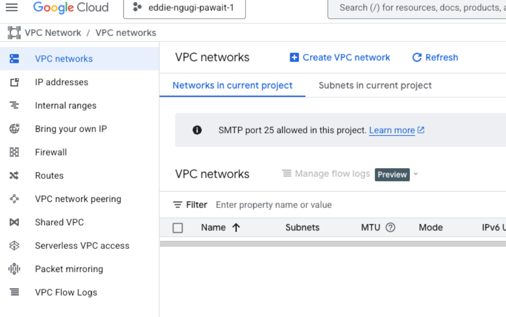
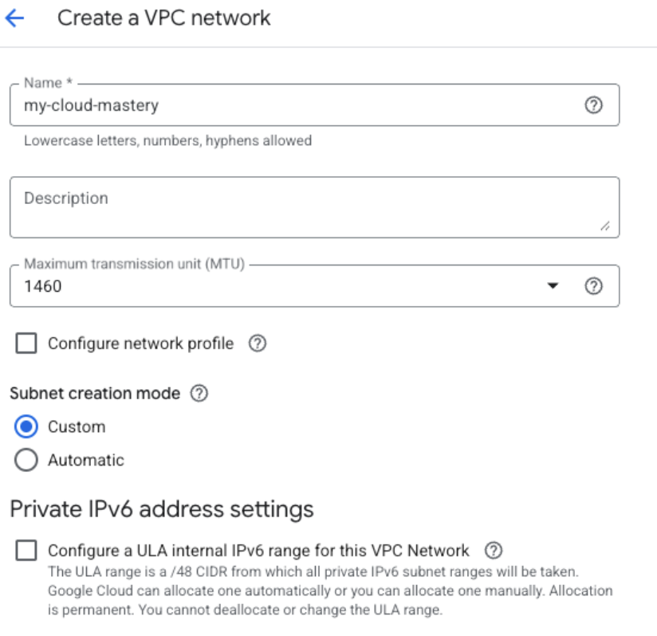

# Create a Google Cloud VPC

It's a best practice to create a dedicated network for your new application within your Google Cloud Project. This provides better security, isolation, and control over your network resources.

## Step 1: Create the Custom VPC Network

1. Navigate to the VPC Networks page in the Google Cloud Console within your project: [https://console.cloud.google.com/vpc/networks](https://console.cloud.google.com/vpc/networks)
2. Click **Create VPC network**
{: style="width: 50%"}
### Configure VPC Settings

**Basic VPC Configuration:**

- **Name**: `my-cloud-mastery-vpc`
- **Description**: VPC for migrated application
- **Subnet creation mode**: Select **Custom**
{: style="width: 50%"}

### Configure Subnet

**Under New subnet, provide these details:**

  - **Name**: `application-subnet`
  - **Region**: Choose a region where you plan to deploy resources, such as `us-central1`
  - **IP address range**: Define a private IP range in CIDR notation  
    - **Recommended**: `10.10.1.0/24` (This gives you 256 addresses, from 10.10.1.0 to 10.10.1.255)
  - **Private Google Access**: Turn it **On** (allows VMs without external IPs to access Google APIs)
  - **Flow logs**: Turn **Off** (unless you need network monitoring)

{: style="width: 50%"}

1. Click **DONE** to finish subnet configuration  
2. Click **CREATE** to create the VPC network

## Step 2: Create Firewall Rules

Navigate to **VPC network → Firewall** and create these essential rules for your new VPC network:

### Rule 1: Allow SSH Access

1. Click **Create Firewall Rule**
2. Configure the following settings:
   - **Name**: `allow-ssh-ingress`
   - **Description**: `Allow SSH access from anywhere`
   - **Network**: `my-cloud-mastery-vpc`
   - **Direction of traffic**: Ingress
   - **Action on match**: Allow
   - **Targets**: All instances in the network
   - **Source filter**: IPv4 ranges
   - **Source IPv4 ranges**: `0.0.0.0/0`
   - **Protocols and ports**: 
     - Check **Specified protocols and ports**
     - Check **TCP**
     - Enter port: `22`

3. Click **CREATE**

### Rule 2: Allow HTTP Traffic

1. Click **Create Firewall Rule**
2. Configure the following settings:
   - **Name**: `allow-http-ingress`
   - **Description**: `Allow HTTP web traffic from anywhere`
   - **Network**: `my-cloud-mastery-vpc`
   - **Direction of traffic**: Ingress
   - **Action on match**: Allow
   - **Targets**: All instances in the network
   - **Source filter**: IPv4 ranges
   - **Source IPv4 ranges**: `0.0.0.0/0` (This allows web traffic from anyone on the internet)
   - **Protocols and ports**:
     - Check **Specified protocols and ports**
     - Check **TCP**
     - Enter port: `80`
3. Click **CREATE**
{: style="width: 50%"}

### Rule 3: Allow HTTPS Traffic (Optional but Recommended)

1. Click **Create Firewall Rule**
2. Configure the following settings:
   - **Name**: `allow-https-ingress`
   - **Description**: `Allow HTTPS web traffic from anywhere`
   - **Network**: `my-cloud-mastery-vpc`
   - **Direction of traffic**: Ingress
   - **Action on match**: Allow
   - **Targets**: All instances in the network
   - **Source filter**: IPv4 ranges
   - **Source IPv4 ranges**: `0.0.0.0/0`
   - **Protocols and ports**:
     - Check **Specified protocols and ports**
     - Check **TCP**
     - Enter port: `443`

3. Click **CREATE**

## Step 3: Verify Your VPC Configuration

1. Navigate back to **VPC networks**
2. Click on your newly created VPC (`my-cloud-mastery-vpc`)
3. Verify the following:
   - **Subnets**: Your subnet should be listed with the correct IP range
   - **Firewall rules**: All three rules should be associated with your VPC
   - **Routes**: Default routes should be automatically created

## Network Architecture Overview

Your VPC now provides:

- **Isolation**: Your migrated application will run in its own network environment
- **Security**: Controlled access through firewall rules
- **Scalability**: Room for additional subnets and resources as needed
- **Private Google Access**: Ability to access Google APIs without external IPs

!!! success "VPC Setup Complete"
    Your Google Cloud VPC is now ready to host your migrated virtual machine. The network provides proper isolation and security for your application.

## What's Next

With your VPC network configured, you're ready to move to Phase 7 where we'll import your VMDK file as a bootable GCP image.

---

  

    <a href="../migration-upload-image/" class="btn-secondary">← Previous: Upload Image to GCS</a>
  

  

    <strong>Section 7</strong> -  Create GCP VPC
  

  

    <a href="../migration-import-image/" class="btn-primary"> Next: Import Image →</a>
  
