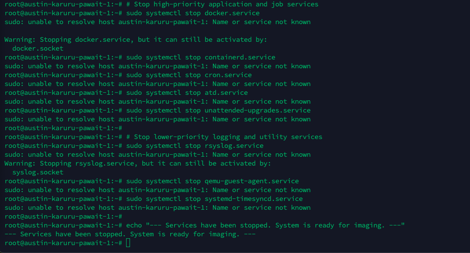

# Preparing the On-Premises VM for Cloning

In this phase, we will prepare the source Virtual Machine to be copied safely with the installed application.

## Step 1: Log into the Source On-Premises Linux VM via SSH

Using your preferred SSH or FTP tool, access the VM using the provided IP for your VM and username and password. For this example, we will use Termius as the client.

!!! note "Example Credentials"
    - **IP Address**: 213.148.17.53
    - **Username**: root
    - **Password**: cloud-mastery
    - **Domain**: train.cloudpartner.africa

Open a Terminal using your preferred SSH client. We recommend Termius, which is a cross-platform SSH client and terminal emulator available for laptops, desktop, and mobile devices. You can learn how to install and set up Termius from [https://termius.com/documentation/installation](https://termius.com/documentation/installation).

For context, we are migrating the application hosted on this virtual machine and accessible via the IP 213.148.17.53 and mapped to [http://train.cloudpartner.africa/](http://train.cloudpartner.africa/)


## Step 2: Install QEMU Utilities

This provides the `qemu-img` tool, which is essential for converting disk formats to our preferred `.vmdk` format to allow us to import the Image in an acceptable format.

```bash
sudo apt install update
sudo apt install -y qemu-utils
```


## Step 3: Identify the Source Disk

Use `lsblk` to list block devices:

```bash
lsblk
```


The original VM's disk will appear as a device, e.g., `/dev/sda`, `/dev/vda`, `/dev/nvme0n1`. Look for the disk that matches the size of your VM's disk.
### Create a partition
```
sudo fdisk /dev/sdb
```
Inside the fdisk prompt, press these keys in order, followed by Enter: n, p, 1, Enter, Enter, w.

### Format the partition
```
sudo mkfs.ext4 /dev/sdb1
```

### Mount the partition
```
sudo mkdir /mnt/imagedisk
sudo mount /dev/sdb1 /mnt/imagedisk
```
Expand the Filesystem (Crucial Step): If you expanded the disk after initially formatting it, you must resize the filesystem to use the new space.

```
sudo resize2fs /dev/sdb1
```

### Verify: Check that the disk is ready and shows its full size.
```
df -h /mnt/imagedisk
```


## Step 4: Identify the Services Running on the Source VM

To identify the services that are running on the source VM, run the following command:

```bash
systemctl list-units --type=service --state=running
```


## Step 5: Stop High Priority Applications and Job Services

!!! warning "Important"
    In order to create an image of the source disk, we need to stop all services running on the Virtual Machine.

To perform this action, run the following commands:

```bash
# Stop high-priority application and job services
sudo systemctl stop docker.service
sudo systemctl stop containerd.service
sudo systemctl stop cron.service
sudo systemctl stop atd.service
sudo systemctl stop unattended-upgrades.service

# Stop lower-priority logging and utility services
sudo systemctl stop rsyslog.service
sudo systemctl stop qemu-guest-agent.service
sudo systemctl stop systemd-timesyncd.service

echo "--- Services have been stopped. System is ready for imaging. ---"
```



## Step 6: Force All Cached Data to Disk

This command ensures that what's in memory gets written to the disk, making the clone more consistent:

```bash
sudo sync && sudo sync
```

!!! success "Phase 1 Complete"
    Your VM is now prepared for cloning. All services have been stopped and cached data has been written to disk.

---

<div class="page-nav">
  <div class="nav-item">
    <a href="../migration-overview/" class="btn-secondary">← Previous: Migration Overview</a>
  </div>
  <div class="nav-item">
    <span><strong>Section 2</strong> - Prepare On-Prem VM</span>
  </div>
  <div class="nav-item">
    <a href="../migration-create-image/" class="btn-primary">Next: Create VM Disk Image →</a>
  </div>
</div>

---