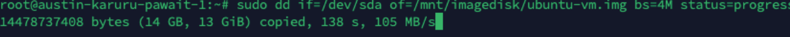

# Creating the Virtual Disk Image (VMDK)

This phase walks you through the process of creating the clone of the virtual machine in a VMDK (Virtual Machine Disk) format.

## Step 1: Create a Raw Image of the OS Disk

This command makes a perfect, bit-for-bit photocopy of your main OS disk and saves it to the helper disk.

!!! warning "Important Note"
    This step will take a significant amount of time due to the size of the disk. Please let it run to completion.

```bash
sudo dd if=/dev/sda of=/mnt/imagedisk/ubuntu-vm.img bs=4M status=progress
```

**Command Explanation:**

- `if=/dev/sda`: The input file is your main OS disk
- `of=/mnt/imagedisk/ubuntu-vm.img`: The output file is a new file on your helper disk

This command will read your entire 50 GB OS disk (`/dev/sda`) and write a raw image file to your new 120 GB disk (`/mnt/imagedisk`).



## Step 2: Verify the Raw Image

After the `dd` command finishes, it is critical that we verify the file is the correct size:

```bash
ls -lh /mnt/imagedisk/ubuntu-vm.img
```

## Step 3: Convert the Raw Image to the Optimized VMDK Format

The raw image is huge. This step converts it into a smaller, more efficient VMDK format that Google Cloud prefers.

!!! tip "Pro Tip"
    The `-O` option below is an uppercase letter O (for Output), not the number zero (`-0`). This is a very common and hard-to-see typo.

```bash
qemu-img convert -f raw -O vmdk /mnt/imagedisk/ubuntu-vm.img /mnt/imagedisk/ubuntu-vm.vmdk
```

## Step 4: Verify that the VMDK and Image Files are Created

Check that the conversion was successful:

```bash
ls -lh /mnt/imagedisk/
```


You should see the large `.img` file and a much smaller `.vmdk` file. The `.vmdk` is what you will upload to a Google Cloud Storage Bucket.

!!! success "Congratulations!"
    You have successfully completed the most difficult part of the process! The VMDK file is now ready for upload to Google Cloud.

---

<div class="page-nav">
  <div class="nav-item">
    <a href="../migration-prepare-vm/" class="btn-secondary">← Previous: Prepare On-Prem VM</a>
  </div>
  <div class="nav-item">
    <span><strong>Section 3</strong> -  Create VM Disk Image</span>
  </div>
  <div class="nav-item">
    <a href="../migration-gcs-bucket/" class="btn-primary">Next: Create GCS Bucket →</a>
  </div>
</div>

---