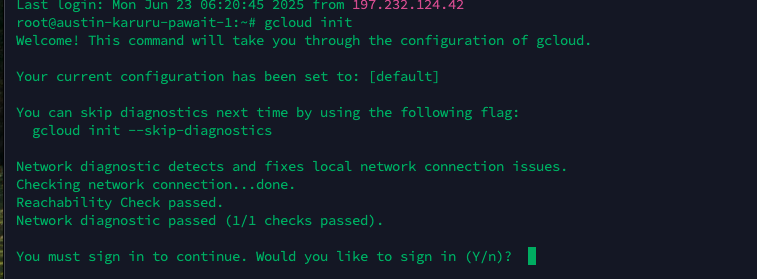
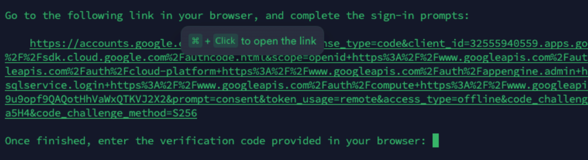
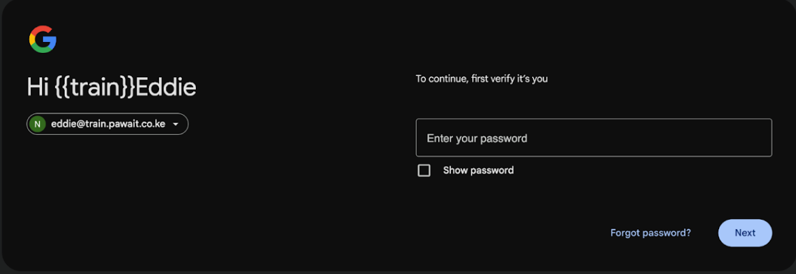
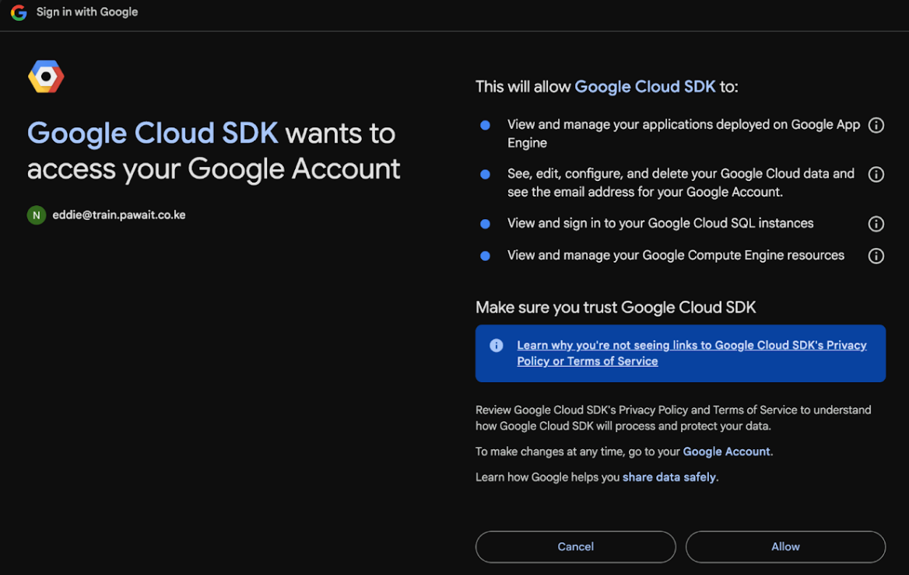
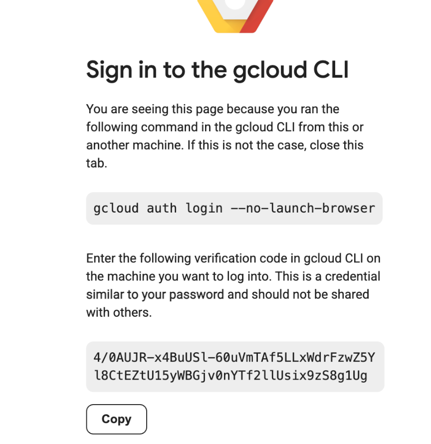
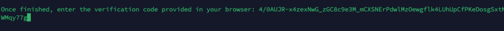
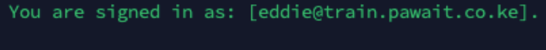
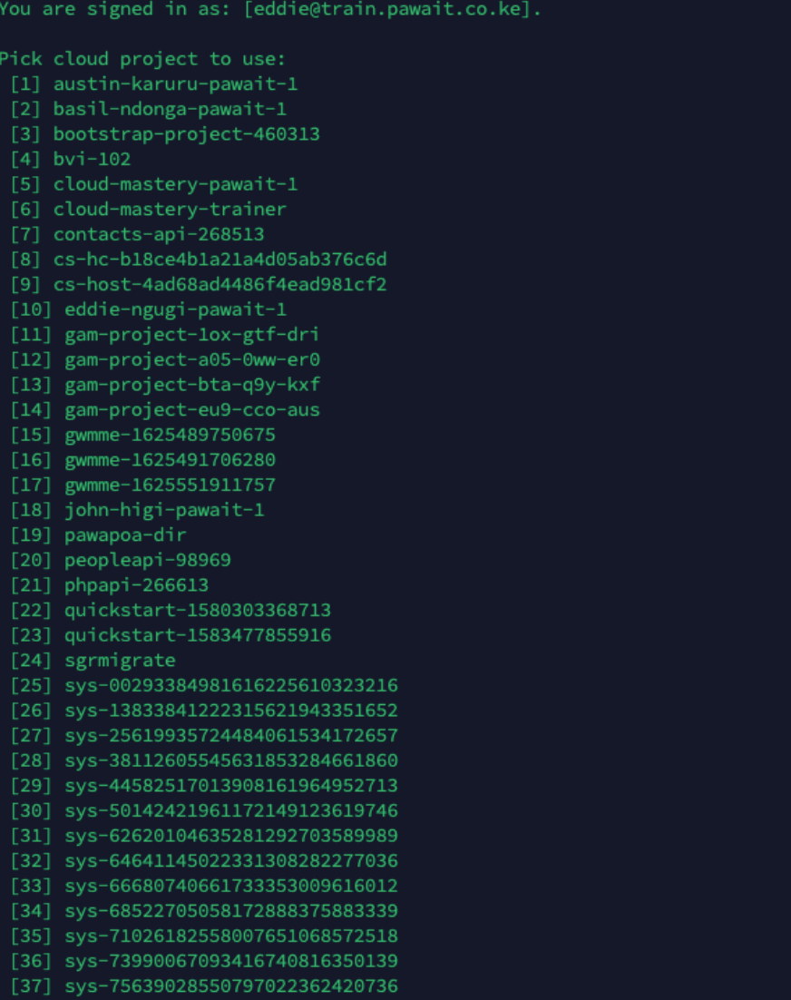
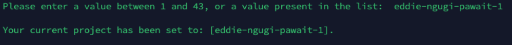

# Install Google Cloud CLI and Authenticate

In this phase, we'll install the Google Cloud CLI on your server and authenticate it to access your Google Cloud resources.

## Step 1: Install Google Cloud CLI

Google Cloud CLI needs to be installed on the server. Follow the installation process based on your operating system.

### For Ubuntu/Debian Systems

```bash
# Add the Cloud SDK distribution URI as a package source
echo "deb [signed-by=/usr/share/keyrings/cloud.google.gpg] https://packages.cloud.google.com/apt cloud-sdk main" | sudo tee -a /etc/apt/sources.list.d/google-cloud-sdk.list

# Import the Google Cloud Platform public key
curl https://packages.cloud.google.com/apt/doc/apt-key.gpg | sudo apt-key --keyring /usr/share/keyrings/cloud.google.gpg add -

# Update the package list and install the Cloud SDK
sudo apt-get update && sudo apt-get install google-cloud-cli
```

### Alternative Installation Methods

For other installation methods, refer to the official documentation: [How to install the Google Cloud CLI](https://cloud.google.com/sdk/docs/install-sdk)

## Step 2: Initialize and Authenticate Google Cloud CLI

Run `gcloud init` to get started:

```bash
gcloud init
```


### Authentication Process

1. **Choose Configuration**: Select option `[1] Re-initialize this configuration [default] with new settings`
2. **Login**: You'll be prompted to log in. Choose `Y` to continue with login
  

3. **Browser Authentication**

  A URL will be provided for authentication

  Copy and paste the URL into your web browser

  

  Log in with your Google Cloud account

  

  Grant the necessary permissions

  
  Copy the verification code from the browser
  {: style="width: 50%"}
**Enter Verification Code**: Paste the verification code back in your terminal
  
If successful, you will see a message letting you know which user you have signed in as
  
**Select Project**: Choose the Google Cloud project where you want to perform the migration
  {: style="width: 50%"}
  {: style="width: 50%"}

**Default Region/Zone**: Configure your default compute region and zone (recommended: choose the same region where you created your storage bucket)
You can also do this by running this command: 
!!! tip 
    Replace zone-name with the us-central1-a

```
gcloud config set compute/zone zone-name
```


### Verification

After completing the authentication process, verify your setup:

```bash
# Check your active account
gcloud auth list

# Check your active project
gcloud config list project

# Test access to your storage bucket
gsutil ls gs://your-bucket-name
```

!!! success "Authentication Complete"
    You should see confirmation that you are signed in and your project is selected. You're now ready to upload files to Google Cloud Storage.

## Troubleshooting

### Common Issues

**Issue**: "gcloud: command not found"
  **Solution**: Restart your terminal or source your shell profile:
```bash
source ~/.bashrc # For Linux based systems
# or
source ~/.zshrc # For MacOS based systems
```

**Issue**: Authentication timeout
**Solution**: Ensure you complete the browser authentication within the time limit. If it expires, run `gcloud auth login` to retry.

**Issue**: Permission denied errors
**Solution**: Make sure your Google Cloud account has the necessary permissions for the project.

---

<div class="page-nav">
  <div class="nav-item">
    <a href="../migration-gcs-bucket/" class="btn-secondary">← Previous: Create GCS Bucket</a>
  </div>
  <div class="nav-item">
    <span> <strong>Section 5</strong> - Install & Configure gcloud CLI</span>
  </div>
  <div class="nav-item">
    <a href="../migration-upload-image/" class="btn-primary">Next: Upload Image to GCS →</a>
  </div>
</div>

---