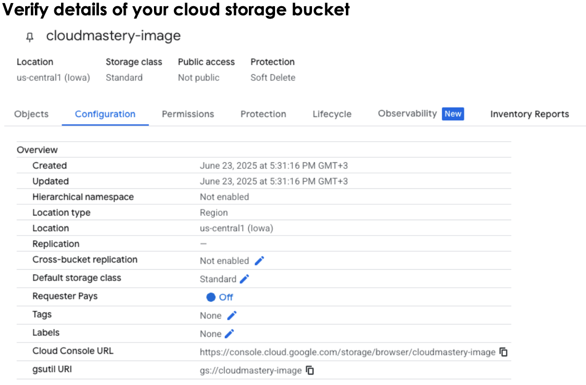

# Create a Google Cloud Storage Bucket

You can create a Google Cloud Storage bucket using either:

- **Google Cloud Console (GUI)**: The easiest method for beginners, using a web browser
- **Google Cloud CLI (gcloud)**: A faster method for those who prefer the command line or need to automate tasks

## Step 1: Create a Google Cloud Storage Bucket

### Using Google Cloud Console (Recommended)

1. **Login to your Google Cloud account** in the browser

2. **Navigate to Cloud Storage**
   - On the top-left corner, click the Navigation menu (☰)
   - Scroll down to the "Storage" section and click on **Cloud Storage > Buckets**

!!! tip "Pro Tip"
    You can also type "Buckets" into the search bar at the top of the console and select the Cloud Storage Buckets page from the results.

3. **Start bucket creation**
   - On the "Buckets" page, click the **"+ CREATE"** or **"CREATE BUCKET"** button
   - This will open the bucket creation wizard

4. **Name your bucket**
   - Give your bucket a globally unique name (e.g., `eddie-ngugi-cloud-mastery`)
   - **Naming rules**: Must contain only lowercase letters, numbers, dashes (-), and underscores (_). Cannot begin or end with a dash
   - **Suggestion**: Use your project ID or company name as a prefix for uniqueness (e.g., `mycompany-vm-image-storage`)
   - Click **"CONTINUE"**

5. **Choose where to store your data (Location)**
   - **Location type**: Select **"Region"** (best choice for this migration task)
     - *Multi-region*: Highest availability, most expensive
     - *Dual-region*: High availability across two regions
     - *Region*: Single geographic location, best balance of cost and performance
   - **Region**: Select a region close to where you'll create your VM (e.g., **us-central1** (Iowa))
   - Click **"CONTINUE"**

6. **Choose a default storage class**
   - Select **"Standard"** - best choice for frequently accessed data
   - The VMDK file will be accessed frequently during the import process
   - Click **"CONTINUE"**

7. **Choose how to control access to objects**
   - Select **"Uniform"** (Enforce public access prevention is recommended)
   - This ensures all access control is managed at the bucket level using IAM permissions
   - This approach is simpler and more secure
   - Click **"CONTINUE"**

8. **Choose how to protect object data (Optional)**
   - For this temporary migration task, leave these settings as **"None"**
   - Advanced features like versioning and retention policies aren't needed
   - Click **"CREATE"**

### Using Google Cloud CLI (Alternative)

If you prefer using the command line, you can create a bucket with:

```bash
gsutil mb gs://your-project-migration-images
```

## Step 2: Verify Your Cloud Storage Bucket

1. Navigate back to the **Cloud Storage > Buckets** page
2. Verify that your bucket appears in the list
3. Click on your bucket name to view its contents (it should be empty)
4. Note the bucket name as you'll need it in the next phases



## Bucket Configuration Best Practices

!!! info "Security Considerations"
    - Use uniform bucket-level access for better security management
    - Consider enabling Object Versioning if you want to keep multiple versions of your images
    - Set up appropriate IAM permissions for your team members

## What's Next

Your Google Cloud Storage bucket is now ready to receive the VMDK file you created in Phase 2. In the next phase, we'll install and configure the Google Cloud CLI to authenticate and upload your disk image.

---

<div class="page-nav">
  <div class="nav-item">
    <a href="../migration-create-image/" class="btn-secondary">← Previous: Create VM Disk Image</a>
  </div>
  <div class="nav-item">
    <span> <strong>Section 4</strong> - Create GCS Bucket</span>
  </div>
  <div class="nav-item">
    <a href="../migration-gcloud-cli/" class="btn-primary">Next: Install & Configure gcloud CLI →</a>
  </div>
</div>