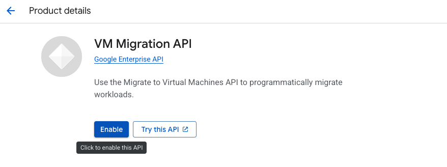
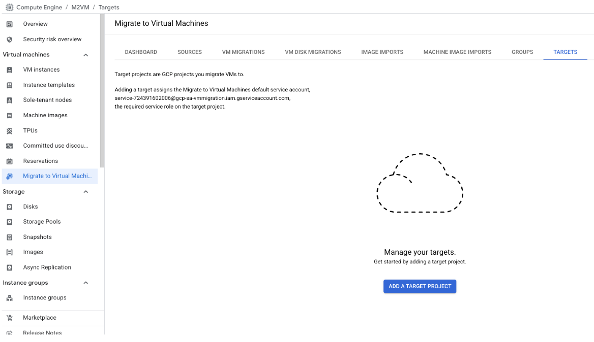
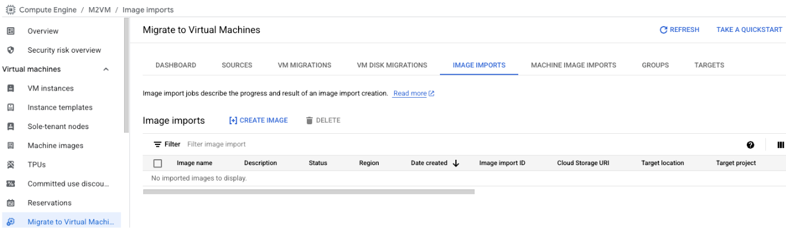
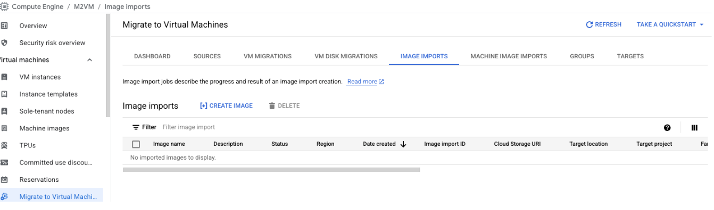
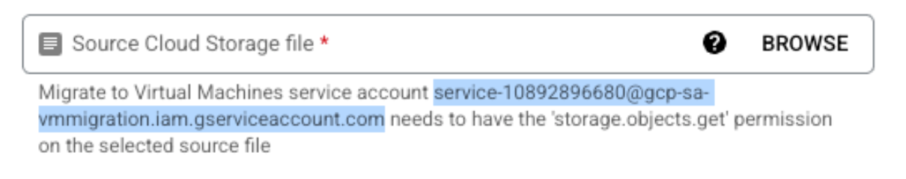
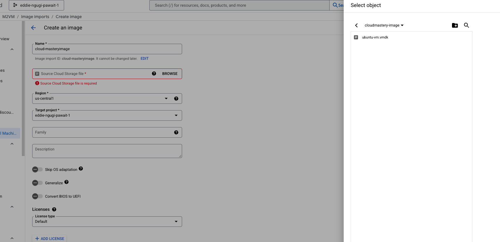
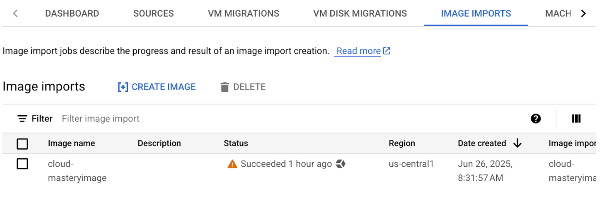

# Import the VMDK as a Bootable GCP Image

This is the most important step in the migration process. It converts your uploaded `.vmdk` disk file into a bootable image template that Google Cloud can use to create new virtual machines.

## Step 1: Enable the VM Migration API

Before you can import an image, you must ensure the **VM Migration API** (also known as "Migrate to Virtual Machines API") is enabled for your project.

1.  Navigate to the VM Migration API page in the Google Cloud Console:
    [https://console.cloud.google.com/compute/mfce](https://console.cloud.google.com/compute/mfce)
2.  If the API is not already enabled, you will see an **Enable** button. Click it to activate the API. This may take a moment.

## Step 2: Set your Target Project

1.  In the Google Cloud console, navigate to the **Migrate to Virtual Machines** section and select the **Targets** Tab

2.  Under the **Targets** Tab click on **Add A Target project**. 
3.  For this case select the current working project and click **Add**

4. Once done the project is added as part of the list of target projects.

## Step 3: Navigate to the Image Imports Tab  and Click Create Image 

## Step 4 : Create an Image 
Under the resulting page, enter the Name of the  Image, you would like to create i.e `cloud-mastery-image`

   *   This will be the name of the final bootable image in GCP.
   * Grant the `Storage Object User` IAM role to the VM Migration service account on the public bucket located at [https://console.cloud.google.com/storage/browser/cloudmastery-image](https://console.cloud.google.com/storage/browser/cloudmastery-image).
  * The service account name will be similar to: `service-10892896680@gcp-sa-vmmigration.iam.gserviceaccount.com`. Remember to copy it.
    

*   **Source**:
    1.  Click **BROWSE**.
    2.  Navigate to your Google Cloud Storage bucket (`cloudmastery-image`).
    3.  Select the `.vmdk` file you uploaded earlier: `ubuntu-vm.vmdk`.
    4.  Click **SELECT**.

*   **Region**: `us-central1`
    *   It's best practice to import the image into the same region where you plan to deploy the VM.

*   **Target project**: `eddie-ngugi-pawait-1`
    *   Ensure this is set to the correct project where you want the image to reside.
    *   For our case, its the same project we are working on.

*   **Family**: `ubuntu-2204`
    *   Grouping images into families makes them easier to manage.

*   **Licenses**: Leave this as **Default**. GCP will automatically detect the OS.

*   **Advanced options (leave as default)**:
    *   Do not check "Skip OS adaptation," "Generalize," or "Convert BIOS to UEFI" unless you have a specific reason. The import tool handles these conversions well automatically.

  Click **CREATE**.
!!! info "Import in Progress"
    The image import process will begin. This can take anywhere from 10 to 30 minutes, or longer, depending on the size of the disk image. You can monitor the progress on the **Image imports** tab.

## Step 5: Validation
You newly imported image should be like so below

!!! success "Image Import Complete"
    Once the status shows as "Succeeded," you have successfully converted your on-prem disk into a reusable, bootable image in Google Cloud.

## What's Next

Now that you have a custom bootable image, you're ready for the final steps. In the next phase, you'll use this image to create a new VM instance in GCP.

---

  

    <a href="../migration-create-vpc/" class="btn-secondary">← Previous: Create GCP VPC</a>
  

  

    <strong>Section 8</strong> - Import VMDK as GCP Image
  

  

    <a href="../migration-create-vm/" class="btn-primary">Next: Create GCP VM Instance →</a>
  

