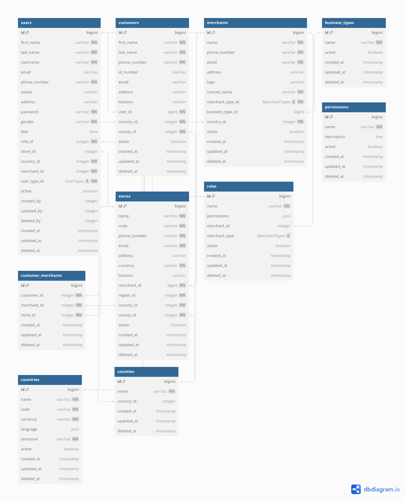

## Introduction
The identity service is a microservice that allows onboarding and user management. It interacts with several other backend services such as core service, payment service and report service. The identity service is responsible for issuing security tokens for the other microservices.

#### User Types
- System
- Business
- Driver
- Customer

### Error Handling

The identity microservice returns error responses with appropriate status codes and error messages in case of invalid requests or errors in the identity management operations.

## Architecture

This guide will help you install **identity service** built on Laravel, hosted on GCP, and deployed to GKE using terraform. The service has three branches, namely **staging**, **qa**, and **master** each pointing to a different environment. We also use Git conventions for commits and host our repository on Bitbucket.

### Installing Locally

If you want to install the service locally for development purposes, follow these steps:

Clone the repository from Bitbucket using Git. You can use the following command:

```bash
git clone https://transmall@bitbucket.org/transmall-dev/identity-micro-service.git
```

Checkout the branch you want to work on. We have two branches: **staging**  and **master**.  
The **staging** branch points to the staging environment and **master** points to production environment.

```php
git checkout <branch-name>
```

Install the dependencies using Composer. Make sure you are in the root directory of the project, where the composer.json is located.

```bash
composer install
```

Create a **.env** file by copying the **.env.example** file and filling in the necessary environment variables.

```bash
cp .env.example .env
```

Generate the application key.

```bash
php artisan key:generate
```

Set up database:
Next, you need to set up a database for your service. Open up the .env file in the root of your app and fill in the details for your database connection. For example:

```makefile
DB_CONNECTION=mysql
DB_HOST=127.0.0.1
DB_PORT=3306
DB_DATABASE=transmall_db
DB_USERNAME=root
DB_PASSWORD=
```

Note: You'll need to create a new database in your MySQL server first before you can connect to it.

Once you've filled in the details for your database connection, run the following command in your terminal:

```bash
php artisan migrate
```

This will create the necessary tables in your database.

### Seeding Data

```bash
php artisan db:seed
```

This will seed the database with the necessary data.

Serve the application using the following command:

```bash
php artisan serve
```

You should now be able to access the service at http://localhost:8000.

### Running Tests

Run the following command from applications root directory

```bash
php artisan test --profile
```

This will run all the tests in your tests directory. If any of the tests fail, you'll see an error message in your terminal.

## Git Conventions

We use the conventional commits specification for our Git commits. Please make sure to follow these guidelines when making commits.

- Use present tense, imperative mood (e.g. "add feature" instead of "Added feature").
- Keep commit messages short and descriptive.
- Separate the subject from the body with a blank line.
- Use bullet points to list the changes made in the commit.

# Database Structure


