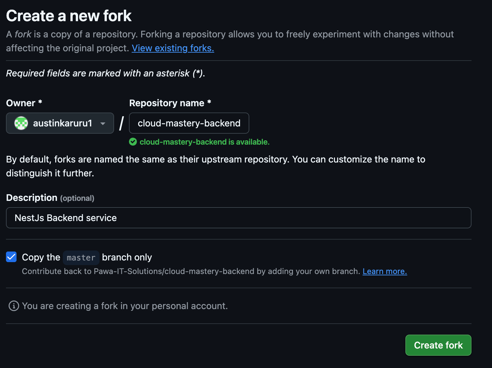
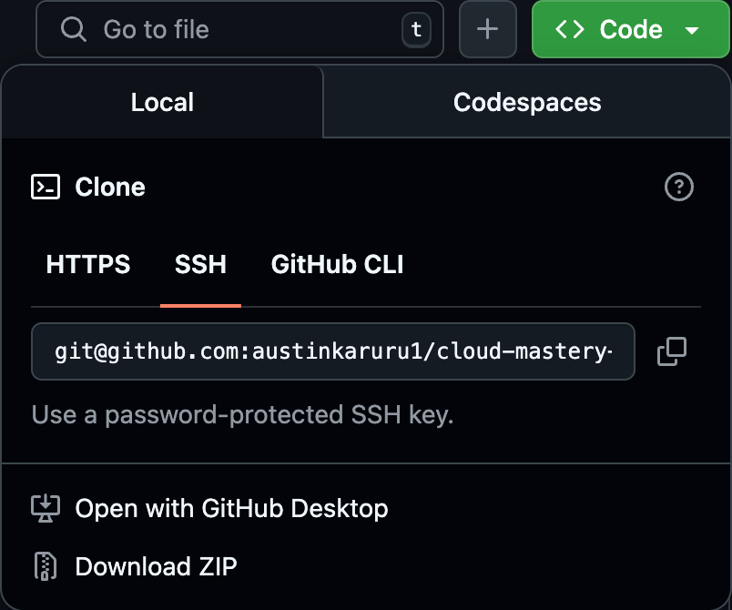
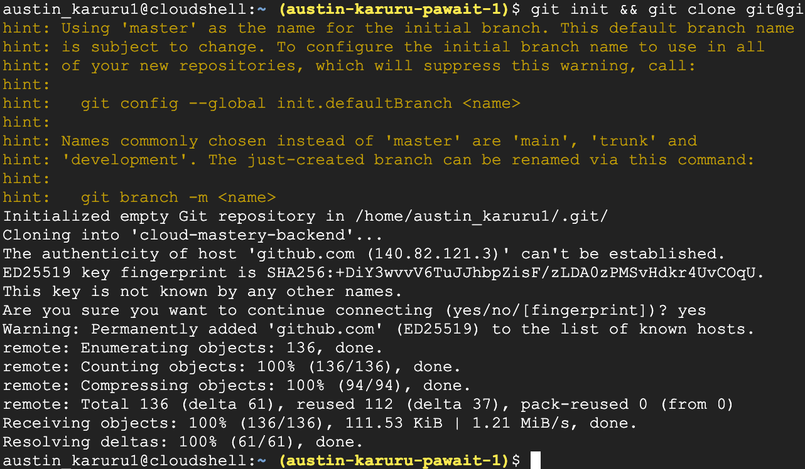

# Prepare Backend Repo

For this lab, we will work with two application repositories: `cloud-mastery-backend` and `cloud-mastery-frontend`. First, we need to set up your GitHub account and configure it to work with your Google Cloud Shell environment.

**Do you have a GitHub Account?**
    If you already have a GitHub account, you can skip directly to the **[Fork the Backend Repository](#fork-the-backend-repository)** section.

---

### Step 1: Fork the Backend Repository

You need your own copy of the application repository to make changes. This is done by "forking" it.

1.  Access the Cloud Mastery backend repository here:
    [https://github.com/Pawa-IT-Solutions/cloud-mastery-backend](https://github.com/Pawa-IT-Solutions/cloud-mastery-backend)

2.  Click the **Fork** button in the top-right corner.

    

3.  On the "Create a new fork" page, you can leave the details as they are and click **Create fork**.

    

4.  You will be redirected to your own forked copy of the repository. It is now ready!

    

---

### Step 2: Clone the Repository to Cloud Shell

Now you can clone your forked repository.

1.  In GitHub, navigate to your forked `cloud-mastery-backend` repository. Click the green **<> Code** button, select the **SSH** tab, and copy the SSH URL.

    

2.  Go back to your **Cloud Shell** terminal and run the `git clone` command, pasting the URL you just copied.
    Replace the URL with your own forked repository SSH URL

    ```
    git clone git@github.com:austinkaruru1/cloud-mastery-backend.git
    ```

3.  When prompted `Are you sure you want to continue connecting (yes/no/[fingerprint])?`, type `yes` and press `Enter`.

    

4.  Navigate into the newly created directory and list its contents.

    ```
    cd cloud-mastery-backend && ls -l
    ```
    

---

## Next Steps

**Great job!** Your GitHub account is configured, and you have successfully cloned the backend application code into your Cloud Shell. Next, we will set up the continuous integration pipeline using Cloud Build.

---
<div class="page-nav">
  <div class="nav-item">
    <a href="../setup-github/" class="btn-secondary">← Previous: Setup Github</a>
  </div>
  <div class="nav-item">
    <span><strong>Section 6</strong> -  Prepare Backend Repo </span>
  </div>
  <div class="nav-item">
    <a href="../setup-backend-pipeline" class="btn-primary">Next: Setup Backend Pipeline →</a>
  </div>
</div>

---


