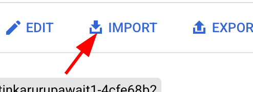
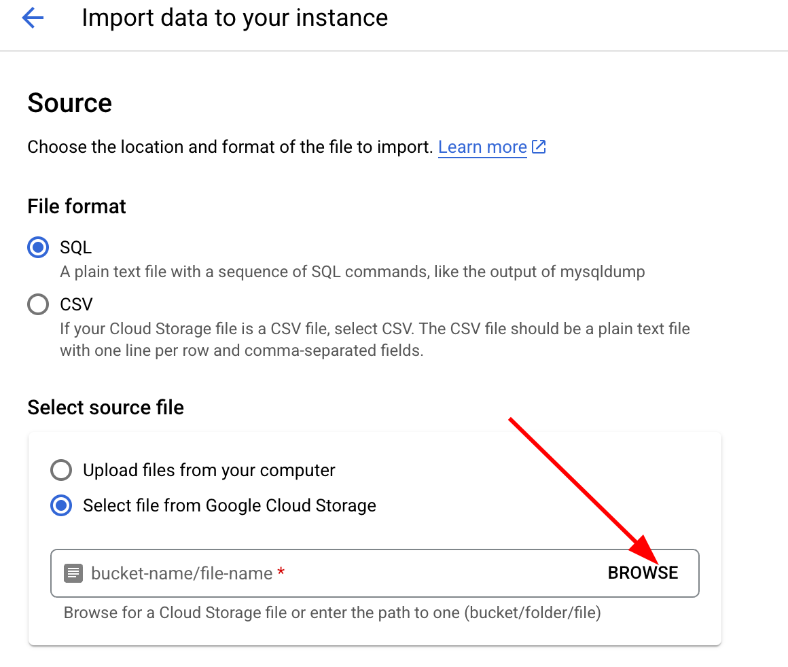
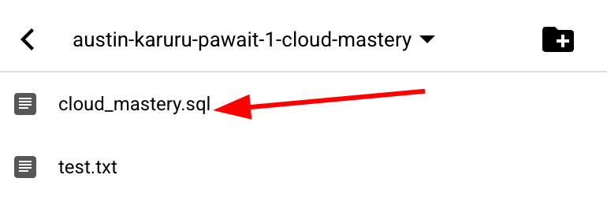
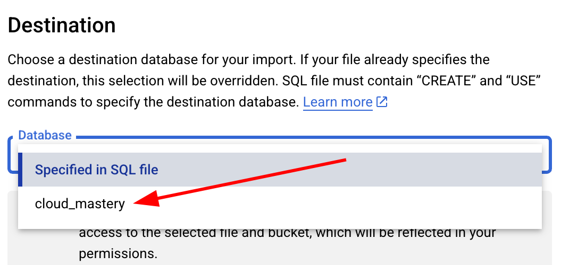

# Setup Database in Cloud SQL

Next, we need to set up the database to ensure all the necessary data is populated for our application. We will do this by importing a pre-configured SQL file into our Cloud SQL instance.

### Step 1: Navigate to Cloud SQL

1.  Navigate to the Cloud SQL instances page by searching for "Cloud SQL" in the top search bar or by using this direct link:
    [https://console.cloud.google.com/sql/instances](https://console.cloud.google.com/sql/instances)

2.  You should see that a Cloud SQL instance has already been provisioned for you.

    

### Step 2: Import the Database

1.  Click on the **Instance ID** to open the instance details page.

2.  At the top of the page, click the **IMPORT** button.

    

3.  On the "Import data" screen, under the **Select source file** section, click **BROWSE**.

    

4.  A popup window will appear showing your Cloud Storage buckets. Double-click on the bucket name that ends with `-cloud-mastery`.

    

5.  Select the `cloud_mastery.sql` file and click the **SELECT** button at the bottom.

    

6.  Finally, under the **Destination** section, expand the **Database** dropdown and select `cloud_mastery`.

    

7.  Click the **IMPORT** button to start the process. The import will begin, and you will be returned to the instance details page.

---

## Next Steps

**Database setup is complete!** You can now proceed to the next step, where we will prepare our GitHub environment.

---

  

    <a href="../devops-lab/" class="btn-secondary">← Previous: DevOps Lab</a>
  

  

    <strong>Section 4</strong> -  Database Setup 
  

  

    <a href="../setup-github" class="btn-primary">Next: Setup Github →</a>
  

---

