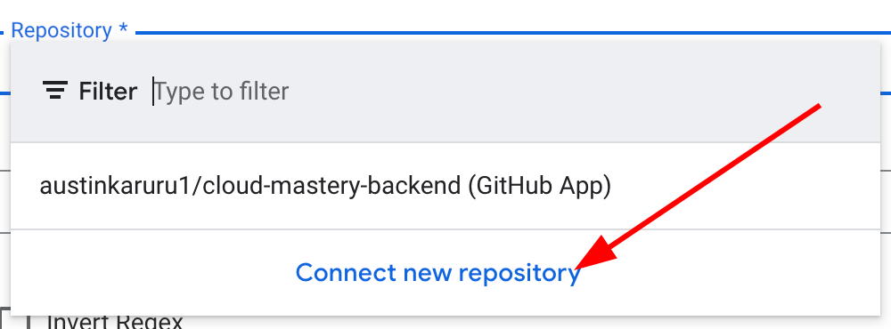
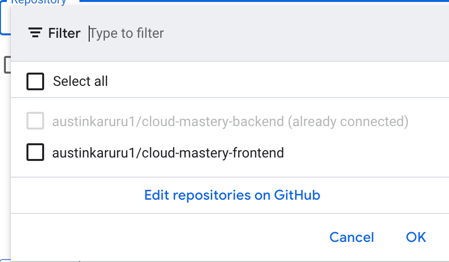
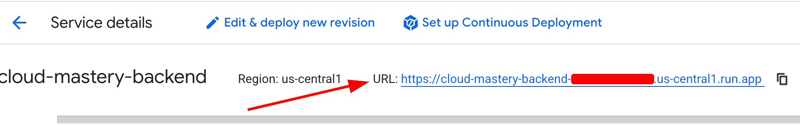
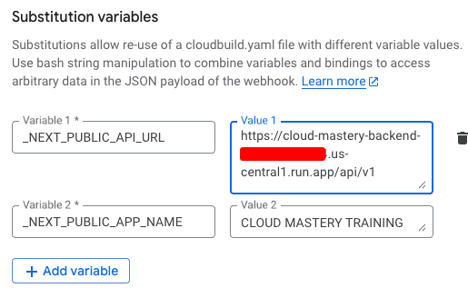
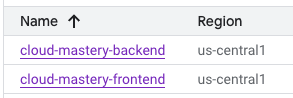

# Setup Cloud Build for the Frontend

We will now create the final CI/CD pipeline for our frontend application. This process is very similar to the backend setup but requires different environment variables for the application to connect to the backend API.

---

### Step 1: Create the Frontend Trigger

1.  Navigate back to **Cloud Build > Triggers** in the Google Cloud console.
2.  Click **Create trigger**.

### Step 2: Configure the Trigger

1.  **Name**: `cloud-mastery-frontend-deploy`
2.  **Region**: `us-central1 (Iowa)`
3.  **Source**:
    *   **Repository**: Select your forked `austinkaruru1/cloud-mastery-frontend` repository from the dropdown. It should already be available since we connected your GitHub account.
        
        
4.  **Branch**: Enter `^master$`
5.  **Configuration**:
    *   **Type**: `Cloud Build configuration file (yaml or json)`
    *   **Location**: `/cloudbuild.yaml` (default)
6.  **Advanced: Substitution Variables**:
    *   This time, we need to add **two** variables. Click **Add variable** twice.

    !!! info "Important: Backend URL Needed"
        One of the variables requires the URL of the `cloud-mastery-backend` service you deployed in a previous step.

    *   **Variable 1**:
        *   **Variable**: `_NEXT_PUBLIC_APP_NAME`
        *   **Value**: `CLOUD MASTERY TRAINING`
    *   **Variable 2**:
        *   **Variable**: `_NEXT_PUBLIC_API_URL`
        *   **Value**: To get this value, open a new tab and go to the **Cloud Run** console. Click on your `cloud-mastery-backend` service and copy its URL.
            
        *   Paste the URL into the value field and **append `/api/v1`** to the end. It should look like this:
            ```
            https://cloud-mastery-backend-xxxxxxxxxx.us-central1.run.app/api/v1
            ```
    

7.  **Service Account**: Select the `terraform-` service account, just as you did for the backend.

8.  Click **Create**. Your Cloud Build Triggers list should now show both the backend and frontend triggers.

    

---

## Next Steps

**Frontend pipeline is configured!** In the final step, we will run this trigger and access our fully deployed application.

---
<div class="page-nav">
  <div class="nav-item">
    <a href="../setup-frontend-repository/" class="btn-secondary">← Previous: Setup Frontend Repo</a>
  </div>
  <div class="nav-item">
    <span><strong>Section 9</strong> -  Setup Frontend Pipeline </span>
  </div>
  <div class="nav-item">
    <a href="../accessing-the-application" class="btn-primary">Next: Access the Application →</a>
  </div>
</div>
---