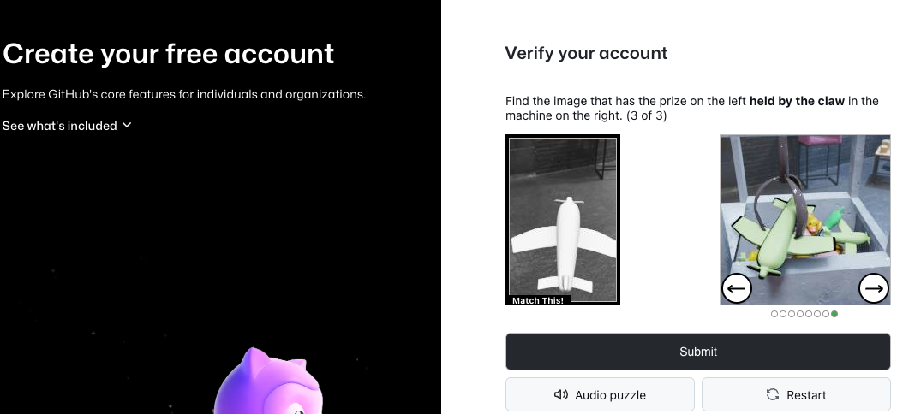
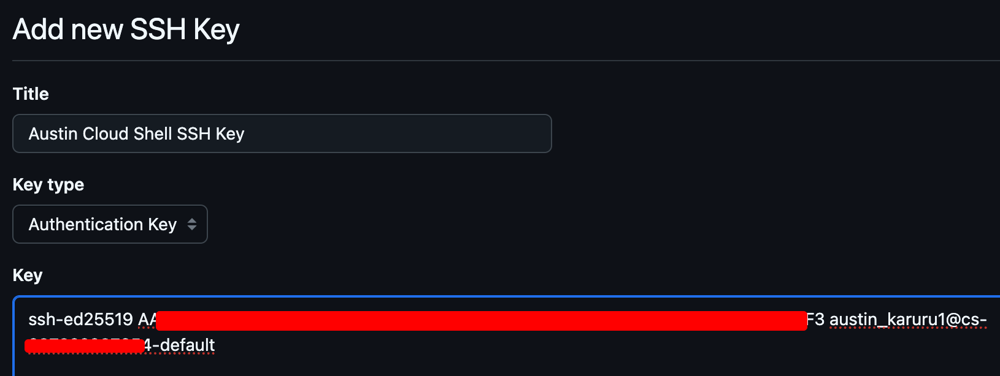

#  Prepare GitHub Environment
For this lab, we will work with two application repositories: `cloud-mastery-backend` and `cloud-mastery-frontend`. First, we need to set up your GitHub account and configure it to work with your Google Cloud Shell environment.

**Do you have a GitHub Account?**
    If you already have a GitHub account, you can skip directly to the **[Fork the Backend Repository](#fork-the-backend-repository)** section.

---

### Step 1: Create or Login to an existing GitHub Account

1.  Navigate to the GitHub signup page: [github.com/signup](https://github.com/signup).

2.  Fill in your details (email, password, username) to create your account.

    

3.  Complete the "Verify your account" puzzle to prove you're human.

    

4.  GitHub will send a verification code to your email address. Enter this code to confirm your email.

    

5.  Once verified, proceed to sign in. Your new GitHub account is now ready!

    

---

### Step 2: Setup SSH Key from Cloud Shell

To securely clone the repository to your Cloud Shell, you need to add your Cloud Shell's SSH key to your GitHub account.

1.  Navigate back to your **Google Cloud Shell** tab.

2.  Run the `ssh-keygen` command to generate a new SSH key. Press `Enter` three times to accept the default file location and create a key without a passphrase.

    ```
    ssh-keygen
    ```
    

3.  Verify that the public key file (`id_ed25519.pub`) was created.

    ```
    ls -l .ssh/
    ```
    

4.  Display the public key and copy its entire content to your clipboard.

    ```
    cat .ssh/id_ed25519.pub
    ```
    

5.  Head back to your **GitHub** tab. Click on your profile icon in the top-right corner and select **Settings**.

    
    

6.  In the left navigation menu, click on **SSH and GPG keys**.

    

7.  Click **New SSH key**. Give it a descriptive **Title** (e.g., "Google Cloud Shell") and paste the copied key into the **Key** field. Click **Add SSH key**.

    

---

## Next Steps

**Github setup is complete!** You can now proceed to the next step, where we will fork and clone backend repo.

---
<div class="page-nav">
  <div class="nav-item">
    <a href="../setup-cloud-sql/" class="btn-secondary">← Previous: Database Setup</a>
  </div>
  <div class="nav-item">
    <span><strong>Section 14</strong> -  Github Setup </span>
  </div>
  <div class="nav-item">
    <a href="../setup-backend-repository" class="btn-primary">Next: Setup Backend Repo →</a>
  </div>
</div>

---
