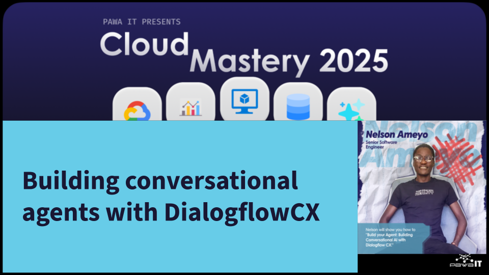
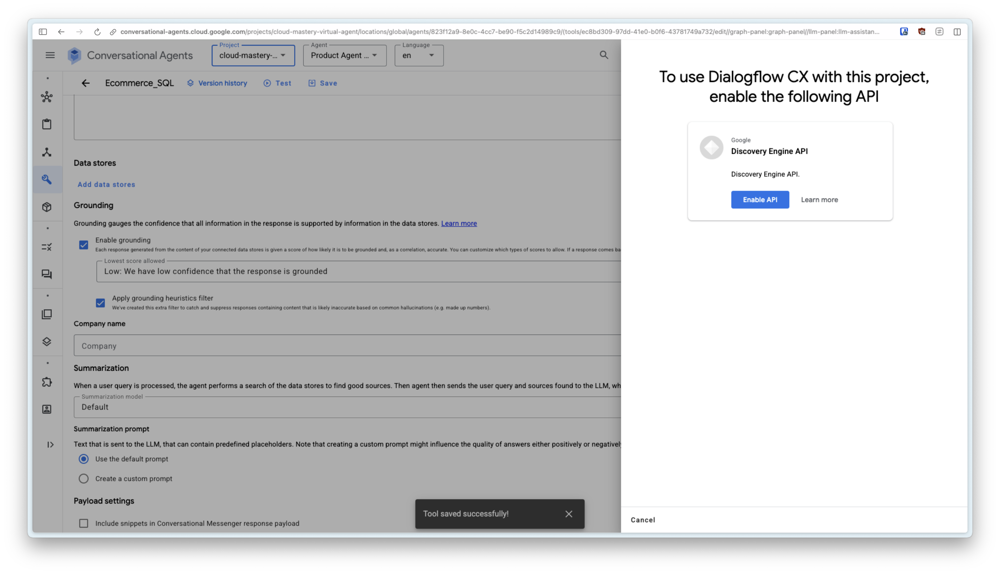
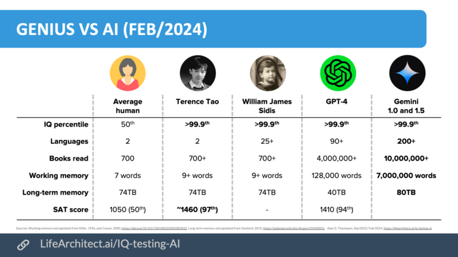
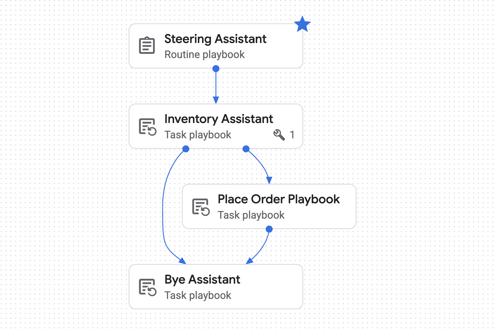
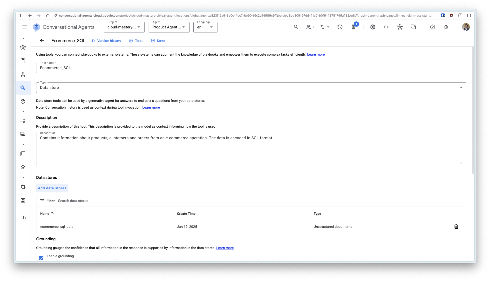
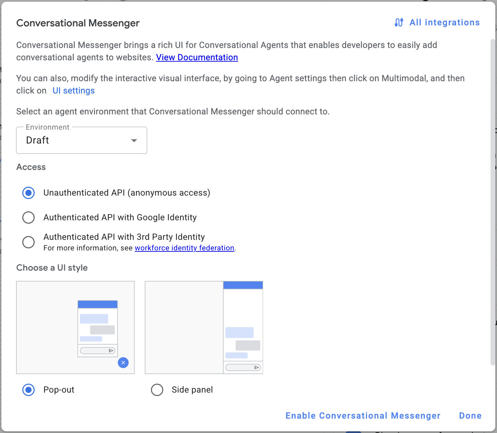
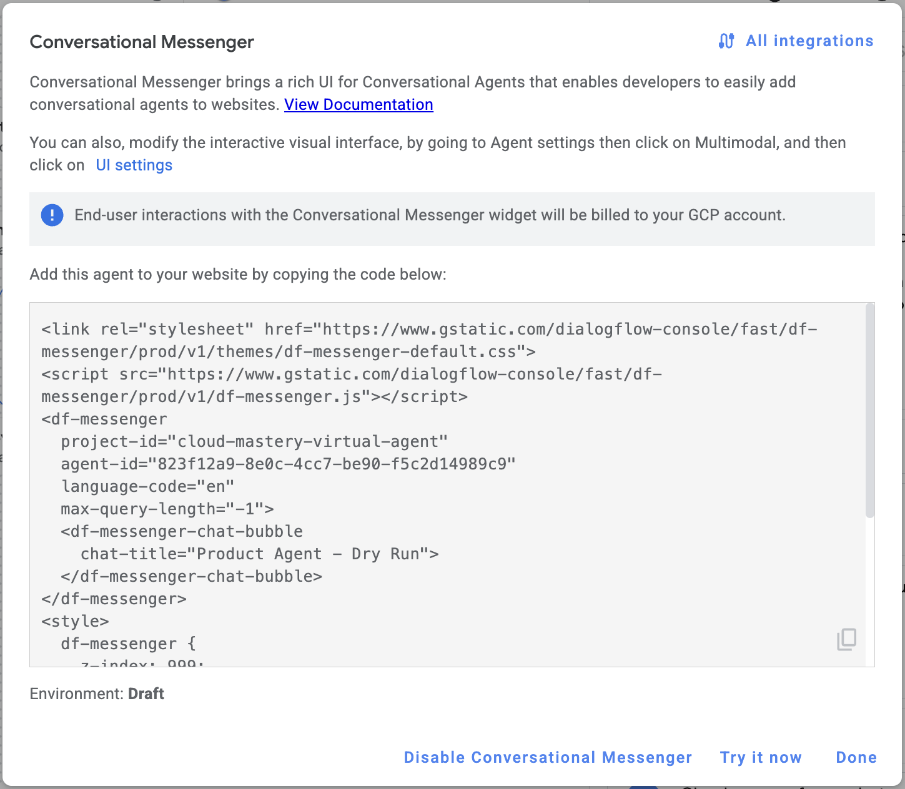

# Building conversational agents with DialogflowCX

<<<<<<< HEAD
=======

>>>>>>> 3f9cddb (Improving docs)

This agent enables customers to browse e-commerce products and complete purchases

## Preparing your agent environment

1. Log into Conversational Agents
2. Select your project. It is already preloaded with your files. You can also  [download the files here](assets/products.json)
3. Click the Create Agent button
    1. Choose "Build Your Own" as the agent type
    2. Enter the agent name and select "Global" for the region
    3. Set the timezone to +3
    4. Select a Playbook
    5. Done
 4. You might also need to enable GCP APIs 
        

## Step Wise Execution : The Mental Model

1. This is just a clear way that man and AI can communicate with clarity
    - We want to set goals, not instructions
    - Clarity is the key to success here because you are dealing with very high IQ here
    - We need focused queries to get best value from the AI model (LLM)
    - Here is some perspective.
        
        
        
2. A word for the wise (we used AI to generate this wisdom):
    
    
    
3. Our mental model will be **Step Wise Execution**. 
    1. Each big task will be broken into small chunks. 
    2. We shall take time to explain everything to the AI like a child. 
    3. Clarity and verbosity is the best simplicity
    4. How does this translate? Example steps to collect a order:

```
- Step 1. Do not greet the user, directly start to collect their order information.
    - Step 1.1. Ask the customer to provide their full names.
    - Step 1.2. Ask the customer to provide their mobile number.
        - Step 1.2.1. Explain it will be given to the delivery guy for the purposes of reaching you in regards to the delivery only.
    - Step 1.3. Ask the customer to provide their delivery address including street name, building name and house number.
    - Step 1.4. Ask the customer for the best time to deliver the battery.
- Step 2. Ask the customer to confirm their order information from Step 1.
    - Step 2.1. To maintain clarity, use bullet points to lay out the confirmation information.
- Step 3. Send payment information to the customer to pay for the battery.
    - Step 3.1. To maintain clarity, use bullet points to lay out the payment information.
    - Step 3.2. Payment will be done with the following MPESA details:
        - MPESA Paybill Number 123456
        - Account Number: 000111
        - Amount: check product_data parameter and display the price
    - Step 3.3. Tell the user an agent will call them within 30 mins of confirmed payment
        - Step 3.3.1. Tell them the delivery guy will come in a branded Chloride Exide van.
        - Step 3.3.2. Ask them to be available at the agreed delivery time to facilitate smooth delivery.
    - Step 3.4. Provide the user with a summary of their order
        - Step 3.4.1. Include relevant information from product_data parameter.
        - Step 3.4.2. To maintain clarity, use bullet points to lay out the payment information.
    - Step 3.5. Ask the user if there is anything else they need help with another car.
        - Step 3.5.1 If the user needs battery for another car, start again from the beginning
        - Step 3.5.2. If the user does not need any more help end the conversation using ${PLAYBOOK:Bye Task Playbook}
```
        

## Workflow Image

We shall approach the agent build in reverse because these assistants fully depend on each other. The order of work shall be:

1. Build data access tool
2. Build Bye Assistant
3. Building Place Order Assistant
4. Building the Inventory Assistant
5. Building the Steering Assistant
6. Debugging and showcase



## Build the Product Data Tool

This tool provides access to product data. 

1. Under Tools click Create
2. Tool Name: `ecommerce_data`
3. Type: `Data store`
4. Description: `Contains information about  ecommerce products`
5. Add Datastore from GCS bucket
6. Select Datastore
7. Enter your company name
8. Model: `gemini-2.0-flash-001`
9. Retain default prompt
10. Save


## Building Bye Assistant

This assistant says bye bye to the customer.

Goal:

```
To end the conversation with the user politely
```

Instructions:

```
- Step 1. Thank the user for choosing to buy from us.
- Step 2. Inform them they will receive their product soon.
- Step 3. Make a funny joke about product_data and end the conversation.
```

## Building Place Order Assistant

This assistant collects customer details and places an order for them.

Goal:

```
To collect necessary billing information from the customer and place the order for the customer if everything is confirmed.
```

Instructions:

```
- Step 1. Do not greet the user, directly start to collect their order information.
    - Step 1.1. Ask the customer to provide their full names.
    - Step 1.2. Ask the customer to provide their mobile number.
        - Step 1.2.1. Explain it will be given to the delivery guy for the purposes of reaching you in regards to the delivery only.
    - Step 1.3. Ask the customer to provide their delivery address including street name, building name and house number.
    - Step 1.4. Ask the customer for the best time to deliver the order.
- Step 2. Ask the customer to confirm their order information from Step 1.
    - Step 2.1. To maintain clarity, use bullet points to lay out the confirmation information.
- Step 3. Send payment information to the customer to pay for the order.
    - Step 3.1. To maintain clarity, use bullet points to lay out the payment information.
    - Step 3.2. Payment will be done with the following MPESA details:
        - MPESA Paybill Number 123456
        - Account Number: 000111
        - Amount: check product_data parameter and display the price
    - Step 3.3. Tell the user an agent will call them within 30 mins of confirmed payment
        - Step 3.3.2. Ask them to be available at the agreed delivery time to facilitate smooth delivery.
    - Step 3.4. Provide the user with a summary of their order
        - Step 3.4.1. Include relevant information from product_data parameter.
        - Step 3.4.2. To maintain clarity, use bullet points to lay out the payment information.
    - Step 3.5. Ask the user if there is anything else they need help with.
        - Step 3.5.1 If the user needs another product, start again from the beginning
        - Step 3.5.2. If the user does not need any more help redirect to ${PLAYBOOK:Bye Assistant}
```

Parameters:

```
Input Params
==================
Key: product_data
Value: Product selected by user

Output Params
==================
Key: product_data
Value: Product selected by user
```

## Building the Inventory Assistant

This assistant has access to product data via a tool. it can answer questions about products, recommend items to the customer and cooperate with other agents to achieve shared goals.

Goal:

```
To answer any questions about products
```

Instructions:

```
- Step 1: Ask the user which product the want to buy.
    - Step 1.1: If the user has no idea what they want, list for them all the products in stock using ${TOOL:ecommerce_data}.
        - Step 1.1.1. Let the user know you can recommend a product at any time if they ask.
    - Step 1.2. If the user wants a recommendation, recommend at most 3 products.
    - Step 1.3. After listing, ask the user what product they would like to buy.
- Step 2. If the user wants a specific product, search for their product in ${TOOL:ecommerce_data}
    - Step 2.1. When performing your search, generate the best query that describes the user's needs.
    - Step 2.2. Lay out your response in the best and most efficient way possible.
    - Step 2.3. All prices are in KES. When writing numbers, always place the tousandth comma e.g. KES 6,000
- Step 3. If user has selected a product, confirm the user selection before proceeding to next step.
- Step 4. If the user wants to order the product, send them onto ${PLAYBOOK:Place Order Playbook}
- Step 5. If user does not want to order a product, redirect to ${PLAYBOOK:Bye Assistant}
- When listing products, always use bullet points to ensure easy readability. Always include the price.
```

Datastore: `ecommerce_data`

Parameters:

```
Input Params
==================
Key: customer_name
Value: Customer name

Output Params
==================
Key: product_data
Value: Product selected by user
```

## Building the Steering Assistant

This assistant will be like traffic police, responsible for guiding the conversation at high level (without taking bribes 😊)

Goal

```
To greet the user politely, state your purpose and ask how you can help them, then redirect them to another agent who will fulfil their request
```

Instructions

```
- Step 1. Greet the customer politely. Always say your name and purpose to the user.
    - Your name is June. Always identify by this name.
    - You work for Mali Safi Ltd.
    - Your purpose is to delightfully assist the user find their dream product and place an order for it.
- Step 2. Ask the user their name.
- Step 3. Then redirect to ${PLAYBOOK:Inventory Assistant}
```

Other Connections

```
None
```

<<<<<<< HEAD
=======

>>>>>>> 3f9cddb (Improving docs)
## Deploying your agent

- On the top navigation, click on Publish Agent
- Choose your deployment environment, access and UI style
- Click Enable Conversational Agent
- Copy the embed code displayed and place it in JSFiddle notebook



---
<div class="page-nav">
  <div class="nav-item">
    <a href="../data-pipeline-visualize-looker/" class="btn-secondary">← Previous: Looker Studio </a>
  </div>
  <div class="nav-item">
    <span><strong>Section 25</strong> -  Virtual Agent Lab </span>
  </div>
  <div class="nav-item">
    <a href="../end-of-training/" class="btn-primary">Next: End of Training →</a>
  </div>
</div>

---
